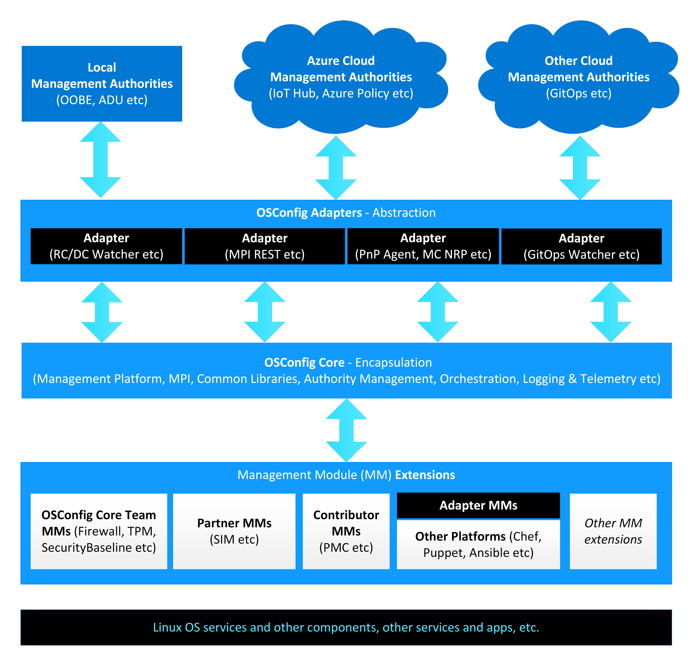
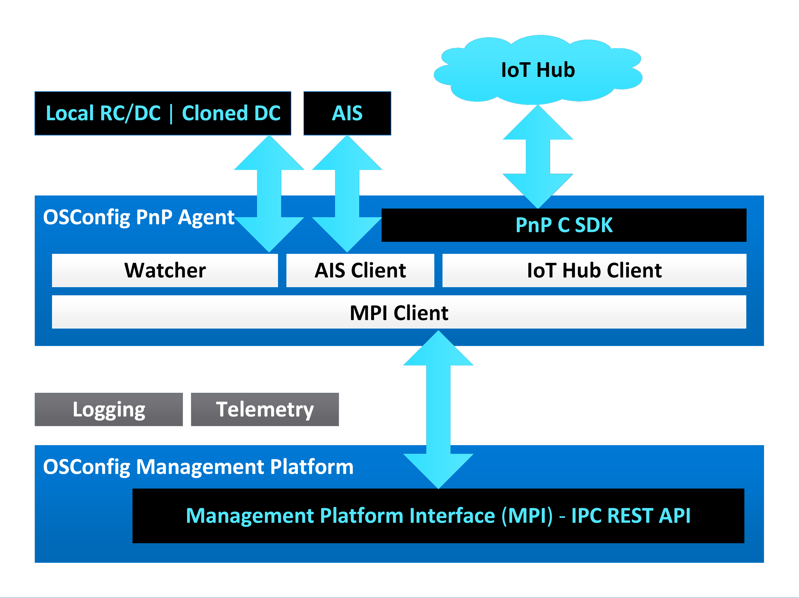
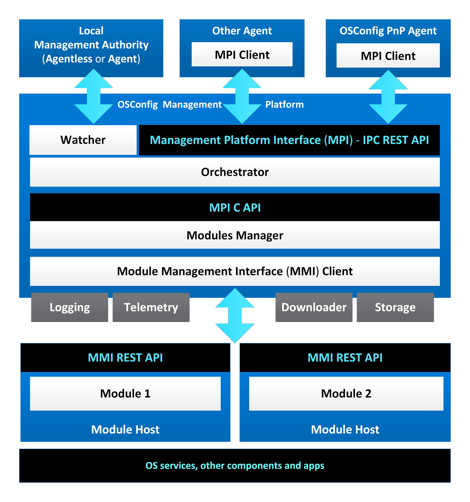
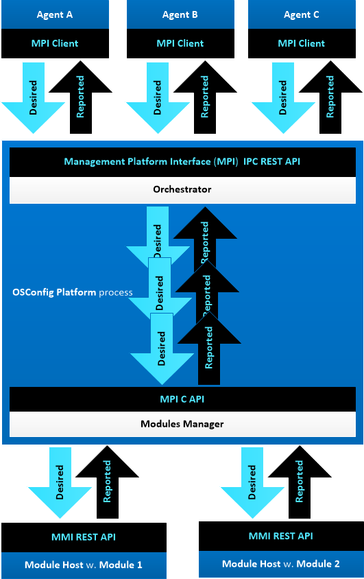
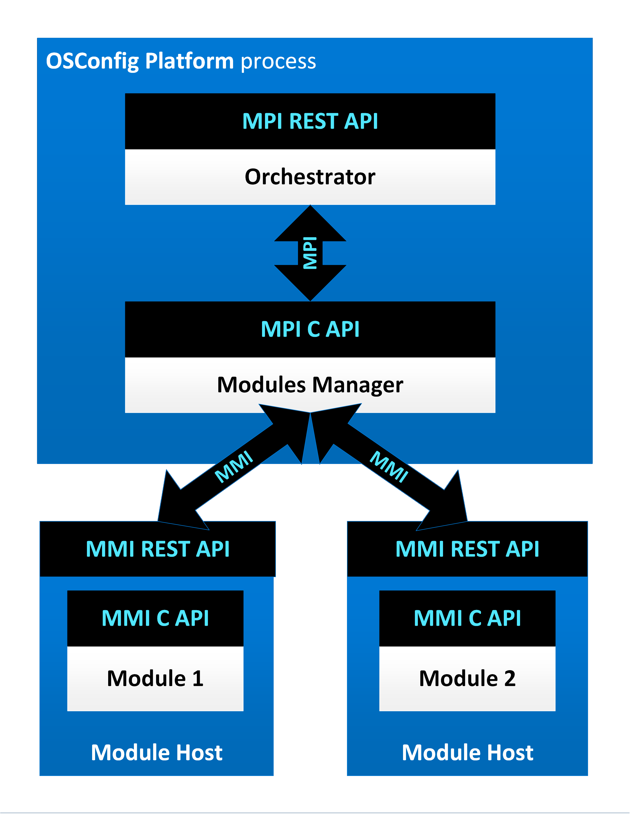
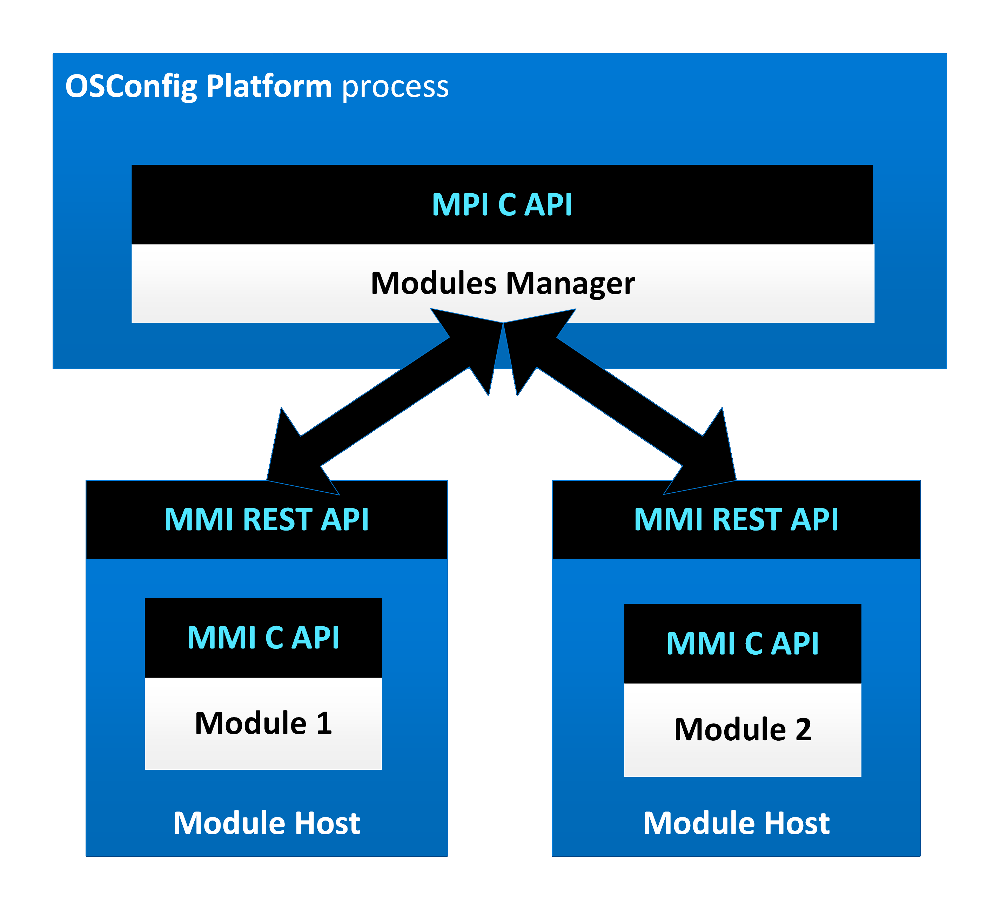
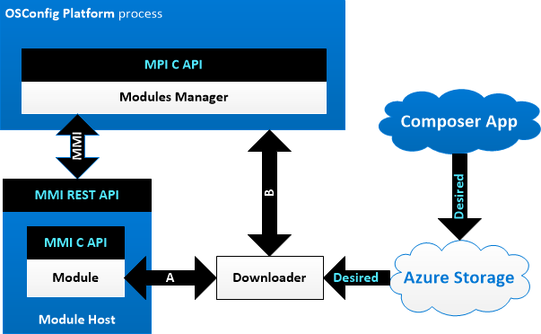
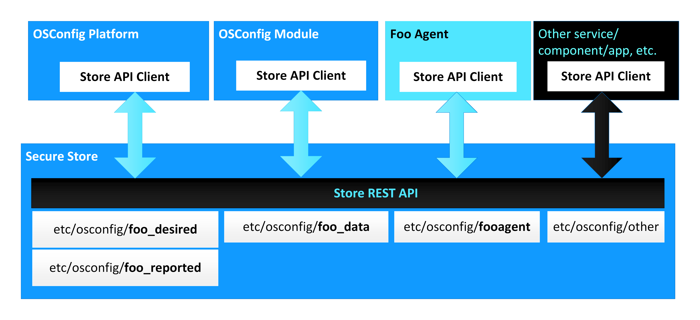
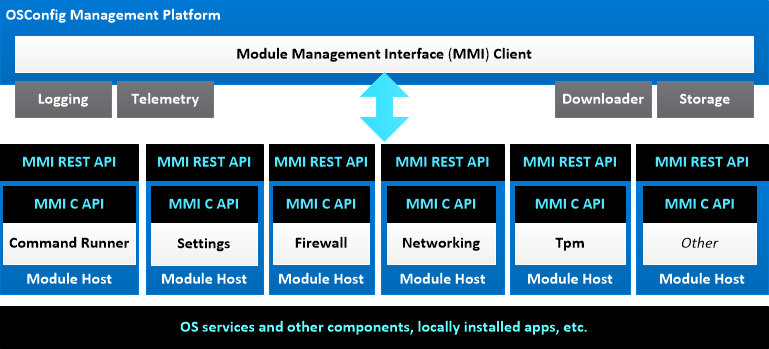
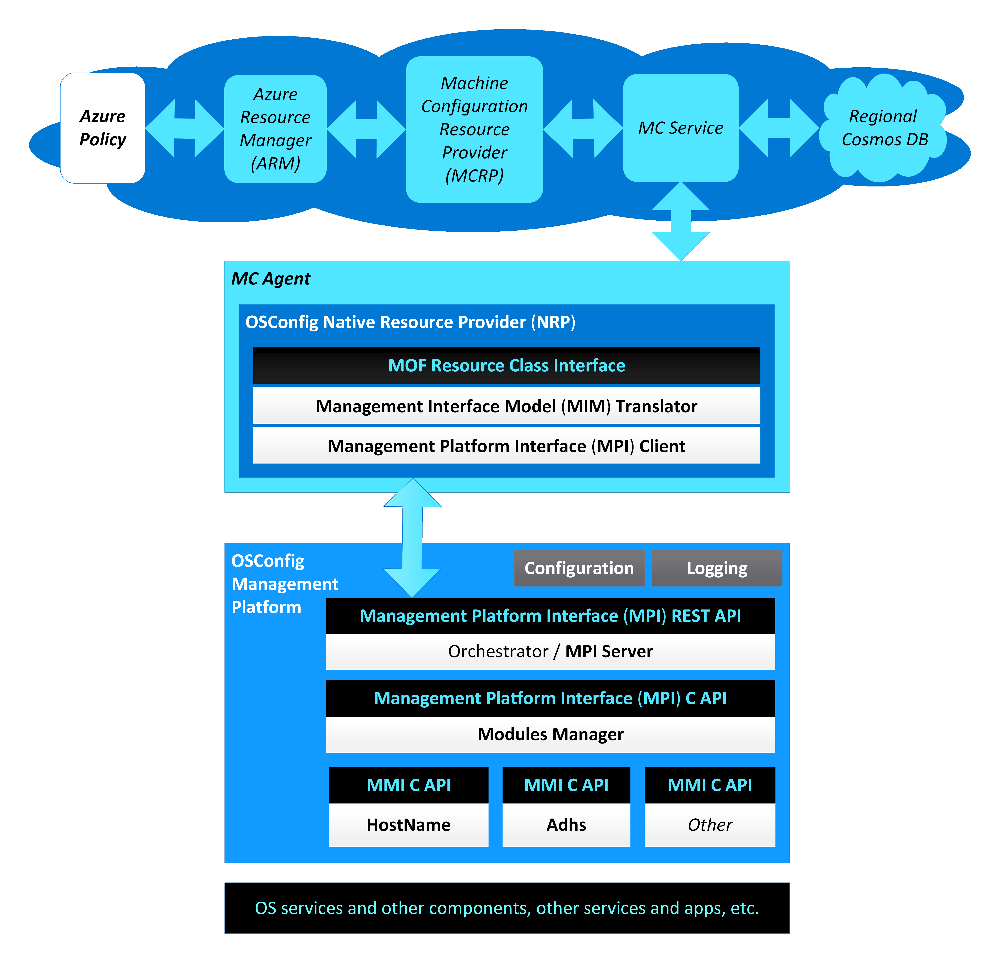

Azure OSConfig - North Star Architecture
========================================

# 1. Introduction

Azure OSConfig is a modular security configuration stack for Linux Edge devices. OSConfig supports multi-authority device management over Azure and Azure Portal/CLI, GitOps, as well as local management.



This document describes the North Star architecture of this project. Its prime target is to guide the people who develop OSConfig. The doc can be also useful to anyone who is interested to learn about this project.

Core design principles for OSConfig are the following:

- Modular, decoupled architecture.
- Portable and extensible to other management platforms.
- Simple and focused on what is truly needed.
- Not permanently tied to any management authority.
- Declarative style device management.

Modular, decoupled architecture means that each layer in OSConfig can be detached from the other OSConfig layers above it and be directly invoked:

- The OSConfig Management Platform can be directly invoked by any management authority adapter over its Management Platform Interface (MPI). The platform is not permanently attached to any adapter.
- Each OSConfig Management Module can be directly invoked over the module's Management Module Interface (MMI), either in-proc or from separate process. The modules are not permanently attached to the platform.

The main way to extend OSConfig is via developing new [OSConfig Management Modules](modules.md).

# 2. Overall OSConfig Architecture

This diagram shows the current North Star architecture of OSConfig. In this diagram and all other diagrams throughout this document the blue areas represents processes. Each component shown in this diagram is summarized in one of following sections of this document:


# 3. OSConfig Agent

## 3.1. Introduction

The OSConfig Agent is a thin client running as a daemon (Linux background service) and it's implementing the following adapters: a Watcher for the Reported Configuration/Desired Configuration (RC/DC), a Watcher for GitOps and a PnP Agent for [IoT Hub](https://learn.microsoft.com/en-us/azure/iot-hub/).

The OSConfig Agent communicates with the OSConfig Management Platform over the Management Platform Interface (MPI) REST API.



The agent is completely decoupled from the platform and the modules. A new module can be installed, and, optionally, PnP interface(s) published as part of the OSConfig Model and that will be enough to make OSConfig use it, without the need to recompile the agent or the platform.

## 3.2. RC/DC Watcher

The RC/DC Watcher monitors the Desired Configuration (DC) file and acts on file changes detected there by making MpiSetDesired calls to the OSConfig Management Platform. The RC/DC Watcher also makes periodic MpiGetReported calls to the OSConfig Management Platform, updating the Reported Configuration (RC) file.

The RC/DC files are written in JSON and follow the [MIM schema](../src/modules/schema/mim.schema.json).

To protect against unauthorized access, the RC/DC files are restricted to root user for both read and write.

The RC/DC files by default reside under `/etc/osconfig/` as `/etc/osconfig/osconfig_desired.json` (the DC file) and `/etc/osconfig/osconfig_reported.json` (the RC file).

## 3.3. GitOps Watcher

The GitOps Watcher clones a Git repository and branch containing a Desired Configuration (DC) file, monitors the cloned DC file and when it detects changes it makes MpiSetDesired calls to the OSConfig Management Platform.

The GitOps DC file by default is named `osconfig_desired.json`, is located in the root of the Git repository and is locally cloned at `/etc/osconfig/gitops/osconfig_desired.json`.

The GitOps DC file is written in JSON and follows the [MIM schema](../src/modules/schema/mim.schema.json).

The Git clone is automatically deleted when the GitOps Watcher terminates. While active, the cloned DC file has restricted access for root user only.

## 3.4. AIS Client

For connecting to IoT Hub, the OSConfig Agent uses HTTP helper APIs from the [Azure IoT PnP C SDK](https://github.com/Azure/azure-iot-sdk-c) to make GET and POST requests to the [Azure Identity Services (AIS)](https://azure.github.io/iot-identity-service/) (identity, key, certificates) to build the device/module identity necessary for IoT Hub connection.

## 3.5. IoT Hub Client

The Agent's IoT Hub Client uses the IoT Client APIs from the [Azure IoT PnP C SDK](https://github.com/Azure/azure-iot-sdk-c) to connect to the [IoT Hub](https://learn.microsoft.com/en-us/azure/iot-hub/), receive Desired Twin updates, and make Reported Twin updates.

The IoT Hub Client does not attempt to parse the property values.

## 3.6. Desired and Reported Twins

The Twins start empty and gradually get filled in with content (desired, from the remote authority and reported, from the device).

When the OSConfig Agent starts, it receives the full Desired Twin and dispatches that to the OSConfig Managament Platform. From there on, incremental changes of the Desired Twin are communicated to the agent, one (full or partial) property at a time.

In the opposite direction, the OSConfig Agent periodically updates the Reported Twin with one property value at a time, reading via the platform from the modules.

## 3.7. MPI Client

The OSConfig Agent links to the common MPI Client library and it uses it to make Management Platform Interface (MPI) calls to the OSConfig Platform as IPC REST API calls over HTTP and Unix Domain Sockets (UDS).

# 4. OSConfig Management Platform

## 4.1. Introduction

The OSConfig Management Platform runs in its own daemon process. The platform communicates with the management authority adapters (the OSConfig Agent, the Universal NRP, etc) over the Management Platform Interface (MPI) REST API.

The platform communicates to the OSConfig Management Modules over the Management Modules Interface (MMI) API.



The platform includes the following main components:

- Management Platform Interface (MPI): MPI as an IPC REST API over HTTP and UDS. This is the main interface for adapters.
- Modules Manager: receives serialized requests over the MPI C API, dispatches the requests to modules over the MMI API.
- MMI Client: makes MMI API calls to modules.

The platform also includes several utility libraries which are shared with all OSConfig components, including adapters and modules:

- Logging: file and console circular logging library.
- CommonUtils: various utility APIs useful for accesing and working with the Linux OS.
- MpiClient: client for the MPI REST API
- Asb: the implementation of the Azure Security Baseline, shared among the Universal NRP adapter and the SecurityBaseline module.

The platform is completely decoupled from the adapters and the modules. The platform can function without any particular adapter. New modules can be installed without changing or recompiling the platform.

## 4.2. Management Platform Interface (MPI)

The Management Platform Interface (MPI) provides a way for the OSConfig Management Platform to be invoked by management authority adapters.

The MPI has two different implementations:

- REST API over Unix Domain Sockets (UDS) for inter-process communication (IPC) with the adapters.
- C API for internal in-process communication between the MPI REST API server and the Modules Manager.

MPI REST API calls include GET (MpiGet, MpiGetReported) and POST (MpiSet, MpiSetDesired).

The MPI C API header file is [src/platform/inc/Mpi.h](../src/platform/inc/Mpi.h)

The MPI is almost identical to the MMI, except that:

- MMI has one extra method, MmiGetInfo, that each Management Module must implement but it is not needed for the MPI
- MPI has the MpiSetDesired and MpiGetReported that the MMI does not have.

For more details on the MMI C API and the similar MmiOpen, MmiClose, MmiFree, MmiSet and MmiGet see the [OSConfig Management Modules](modules.md) specification.

For more about MpiGetReported and MpiSetDesired see the next section.

### 4.2.1. Functional parity between local and remote management

In addition to the common MpiGet and MpiSet an additional pair of MpiGetReported and MpiSetDesired MPI calls are provided so local management authorities such as OOBE can contact the OSConfig Management Platform directly exchanging full or partial desired and reported payload like it happens for the Digital Twins in the following JSON format, including one or many MIM components and MIM objects:

```
{"ComponentName":{"objectName":[{"stringSettingName":"some value","integerValueName":N,"booleanValueName":true|false,"integerEnumerationSettingName":N,"stringArraySettingName":["stringArrayItemA","stringArrayItemB","stringArrayItemC"],"integerArraySettingName":[A,B,C],"stringMapSettingName":{"mapKeyX":"X","mapKeyY":"Y","mapKeyZ":"Z"},"integerMapSettingName":{"mapKeyX":X,"mapKeyY":Y,"mapKeyZ":Z}},{...}]},{"objectNameZ":{...}}},{"ComponentNameY":{...}}
```

Example:

```json
{"CommandRunner":{"commandArguments":{"commandId":"726","arguments":"ls", "action":4}}, "Settings":{"deviceHealthTelemetryConfiguration":2, "deliveryOptimizationPolicies":{"percentageDownloadThrottle":90,"cacheHostSource":2, "cacheHost":"Test cache host","cacheHostFallback":2021}}}
```

This format is following the MIM JSON payload schema described in the [OSConfig Management Modules](modules.md) specification.

## 4.3. Orchestrator

The Orchestrator receives management requests from Adapters over the Management Platform Interface (MPI) IPC REST API. The Orchestrator combines the requests in a serial sequence that it feeds into the Module Manager to dispatch the requests to the respective Management Modules.



What the Orchestrator does:

- Receive management requests from one or multiple management authority adapters.
- Combines requests into one serial sequence.
- Skips duplicate requests. For example, a duplicate request to set DeviceHealthTelemetry to Optional.
- Applies a certain order for requests simultaneously arriving from separate authorities per a list of priorities to be created as part of the configuration at /etc/osconfig/osconfig.json. For example, if a request to set DeviceHealthTelemetry to Optional arrives at the same time with a CommandArguments.Action.Shutdown to pipe them in this order. Or: NetworkConnections.DesiredConnectionConfiguration.Action=ChangeIpv4Address results in network connection loss to automatically invoke RollbackConnectionConfiguration.
- Return over the MPI to the adapters the module responses from the Modules Manager.

What the Orchestrator does not do:

- Make multiple calls in parallel into the Modules Manager (such as over separate threads). The Orchestrator combines multiple parallel pipes into one single serial pipe and feeds MPI requests into the Modules Manager on a single thread.
- Retry failed requests on its own. The Management Modules can internally retry, the upper OSConfig stack, including the Orchestrator, should not automatically retry.
- Create new or modify requests in a way that is incompatible with the MIM contracts with Management Modules.

For IoT Hub and the Digital Twins:

- The Orchestrator cannot change midway in the platform desired requests from the Twins and cannot change reported requests to the Twins - doing so violates the Twins-MIM contract.
- Once a desired object is set on the Twin, that object gets automatically re-applied to the device until it is corrected on the Twin by the remote authority. OSConfig can reject a desired payload but cannot correct that payload on the Twin. The device cannot change Desired Twin content.

Special OSConfig Management Modules that implement more complex scenarios and only invoke other modules, without adding any other OS configuration of their own, can also orchestrate.

## 4.4. Modules Manager

The Modules Manager receives serialized MPI C API requests from the MPI REST API server and/or from the Orchestrator and dispatches the requests over MMI to the appropriate Management Modules. The Modules Manager returns the responses from the modules to the MPI REST API server and/or the Orchestrator.



What the Module Manager does:

- Searches for a locally installed module. Modules are installed as Dynamically Linked Shared Object libraries (.so) under a predefined location (such as:  /usr/lib/osconfig/ and /usr/local/lib/osconfig).
- Dynamically loads and unloads the Module Shared Object library (.so) -or- forks and stops the Module Host process to load/unload the module.
- Forwards MPI calls as MMI to the module/Module Host.
- Issues MmiGetInfo to a loaded module/forked Module Host process to identify that module.
- Maintains an internal list of loaded modules/forked Module Hosts.
- (only when modules are loaded in-process by manager) Persists state and if a particular module crashes too many times, decide to not load that module anymore and fail any MPI calls for.
- When two or more Modules implementing the same components are present, decides which module to load/fork using version info reported by the modules.
- Keeps a module loaded according to the respective module configuration either for the entire duration of the platform process or may decides to unload that module/stop the forked module Host after a period of inactivity and reload/re-fork when a new request arrives.
- Keeps track of multiple parallel client MPI sessions.

What the Module Manager does not do:

- Orchestrate incoming requests among modules. The Modules Manager dispatches requests in the order they arrive from the Orchestrator.
- Receive input from multiple callers. The Orchestrator orders the requests from multiple management authorities in one sequence that is feed into the Modules Manager.
- Retry the same MMI request to a module multiple times after a failure. The modules can internally retry, the upper OSConfig stack, including the Modules Manager shall not automatically retry.

## 4.5. Module Host

The Module Host is a thin executable shell provided by OSConfig that wraps (loads) a Management Module (Dynamically Linked Shared Object library .so) and provides the Unix Domain Sockets (UDS) Module Management Interface (MMI) REST API on behalf of the loaded module which allows the module to be called by any management authority directly, by-passing rest of OSConfig, if needed. The Module Host communicates with the loaded module over the MMI C API that the module implements.

If the modules are loaded directly in the parent OSConfig process they can communicate with each other with ease (for good and wrong), but also: one module can invade the privacy of other modules (and of the parent), and one module can crash and bring down the entire process.



Isolating the modules into their own processes makes it harder for them to inter-communicate but also makes them more secure.  The restriction for inter-module communication with the Module Host is compensated by the modules ability to contain multiple MIM components. For example, the Wi-Fi Configuration needs Wi-Fi Certificate Management, and these can be made into two MIM components hosted in the same Wi-Fi Module.

For more details on the Module Interface Model (MIM) and MIM components see the [OSConfig Management Modules](modules.md) specification.

## 4.6. Module Management Interface (MMI)

The Management Module Interface (MMI) is almost identical to the Management Platform Interface (MPI), except that:

- MMI has one extra method, MmiGetInfo.
- MPI has two additional methods, MpiSetDesired and MpiGetReported, that the MMI does not have.

Like the MPI, the MMI has two different implementations:

- REST API over Unix Domain Sockets (UDS) for inter-process communication (IPC) between the Management Platform (the Modules Manager) and the Module Hosts.
- C API for internal in-process communication between the Modules Hosts and their modules.

The MMI REST API allows Modules to be directly called by any management authority Adapter if needed. This is also the main channel of communication of modules with the OSConfig Management Platform.

REST API calls include: GET (MmiGet, MmiGetInfo) and POST (MmiSet).

The MMI C API header file is [src/modules/inc/Mmi.h](../src/modules/inc/Mmi.h)

For more details on the MMI C API including MmiGetInfo see the see the [OSConfig Management Modules](modules.md) specification.

## 4.7. Downloader

For requests that involve big data, instead of the actual data being transmitted over the MPI and MMI, download URI paths could be transmitted, pointing to desired configuration files uploaded (for example, on Azure Storage) by a Composer App (editor app for the desired configuration files).



The Downloader can be a Dynamically Linked Shared Object library (.so) provided by OSConfig for benefit of both OSConfig Management Platform (when downloads go into platform - see B) and (where this is mostly expected to be needed - see A) for Management Modules. The modules would load this dynamic Downloader library in their Module Host processes and invoke the Downloader API.

## 4.8. Secure Store

The OSConfig Management Platform and the Management Modules may need to persist data locally to be available across device reboot.

To make it easier for Module developers, OSConfig can provide a Secure Store storage component either as a Dynamically Linked Shared Object library (.so) loaded by the OSConfig Platform or running in its own separate daemon process.

The store can be accessed over a Store REST API modeled after the MPI REST API. The Store API can store and retrieve MIM settings per MIM components and MIM objects, per management authority, and can also add audit logging, to record who did what and when. A Store Client API can be provided as a static library.

The Secure Store storage can be under /etc/osconfig/, like the current RC/DC files, just separate per MIM component (such as for example /etc/osconfig/firewall_desired.json) and client (for example /etc/osconfig/configlock) and (unlike RC/DC files) not meant to be accessed directly and/or by any local management authority or user, but only by OSConfig and other Store API clients. The files could be encrypted in a way that only legit Store API clients can decrypt.

By default file access would be restricted to root for everything, including read. The North Star for the Secure Store is to block all direct access to the files, except via the Store API.



## 4.9. Logging

OSConfig provides a Logging library component that makes it easy for all OSConfig components to log in a standard fashion to date and time stamped self-rolled log files.

For more details on the Logging library and its use by modules see the [OSConfig Management Modules](modules.md) specification.

## 4.10. Telemetry

OSConfig has limited Telemetry via its product information submitted to the IoT Hub. OpenTelemetry is a potential future path.

# 5. OSConfig Management Modules

## 5.1. Introduction

Each Management Module typically implements one OS configuration function. OSConfig isolates the module from the [PnP](https://docs.microsoft.com/en-us/azure/iot-pnp/overview-iot-plug-and-play) and the [Digital Twins Definition Language (DTDL)](https://github.com/Azure/opendigitaltwins-dtdl/blob/master/DTDL/v2/dtdlv2.md) protocols and from the Edge authentication with the IoT Hub. OSConfig communicates with the Module over a Module Interface Model (MIM) and the Management Module Interface (MMI) that each module implements. The module developer is not required to learn Azure IoT technologies like PnP,  DTDL, DPS, AIS, etc. and instead can focus on designing the PnP-agnostic MIM and the module implementation.



Modules are implemented as Dynamically Linked Shared Object libraries (.so). Each module runs loaded either in the platform process, or into its own Module Host process, isolated from the other modules. The Module Hosts implement the Management Module Interface (MMI) as an IPC REST API and make MMI C API calls into their hosted modules.

In summary, each module must:

- Be a Dynamically Linked Shared Object library (.so).
- Implement the Management Module Interface (MMI) API.
- Model the MMI data following a Module Interface Model (MIM).
- Log operation and errors via the OSConfig's logging library.
- Be able to function in isolation, all by itself.
- Not require any additional change in the OSConfig stack.
- Be completely decoupled from other modules and from the rest of the OSConfig stack.

For more information about modules and MIM see the [OSConfig Management Modules](modules.md) specification.

## 5.2. Module Interface Model (MIM)

The Module Interface Model (MIM) is composed of MIM components, MIM objects, and MIM settings. A module that can be described by a set of components, objects and settings can be translated to PnP and DTDL and still be generic enough so it could be reused for other managament platforms.

The Module Management Interface (MMI) is used to transport desired and reported object payloads (to and from the module) that follow the MIM.

The MIM assumes a declarative style of communication between the upper layer and the module, where the desired and reported configuration of the device is communicated in bulk (for PnP this configuration being stored on the Twins), not a procedural style with multi-step negotiation.

For more information about the MIM see the [OSConfig Management Modules](modules.md) specification.

## 5.3. OSQuery Module

The OSQuery Module implements an adapter for [OSQuery](https://www.osquery.io/). This module can support multiple MIM components and PnP interfaces that are read-only (all reported, no desired configuration) and leverage OSQuery to retrieve the respective configuration from the device.

## 5.5. Orchestrator Module

In general, we can adapt OSConfig Management Modules to Azure Policy and Machine Configuration by flattening their MIMs (all simple objects, one simple type setting per object) and matching desired with reported.

A new kind of OSConfig Management Module can be added: an Orchestrator Module loads other modules and execute combination of standard OSConfig module scenarios, without dealing itself with any direct OS configuration. There can be one or multiple Orchestrator Modules, each one of them using a different combination of standard modules, and/or using same modules but in different ways. The power of Orchestrator Modules is that they can wrap more complex scenarios in simple MIM models and thus work better with Azure Policy.

# 6. OSConfig Universal Native Resource Provider (NRP)

The OSConfig Universal Native Resource Provider (NRP) Adapter links OSConfig to the [Azure Automanage Machine Configuration (MC)](https://learn.microsoft.com/en-us/azure/governance/machine-configuration/).

Using MC and the OSConfig Universal NRP, we can create Azure Policies that automatically target for compliance audit or remediation all Linux Arc devices in a particular Azure subscription and Azure resource group.

The Universal NRP can audit and remediate the the [Azure Security Baseline for Linux](https://learn.microsoft.com/en-us/azure/governance/policy/samples/guest-configuration-baseline-linux) either by itself (acting as 'OSConfig for MC') or via the SecurityBaseline module. In the future the Universal NRP could be used for other scenarios.



For more information see [src/adapters/mc/README.md](../src/adapters/mc/README.md) and [src/modules/securitybaseline/README.md](../src/modules/securitybaseline/README.md).
