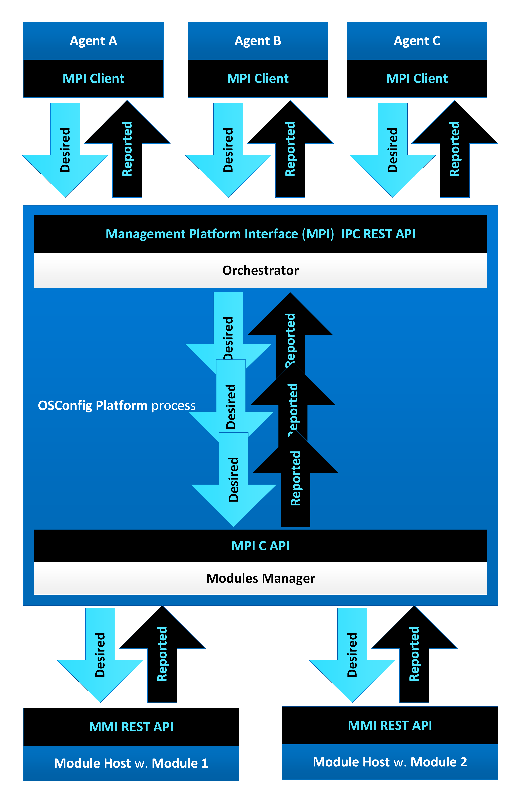
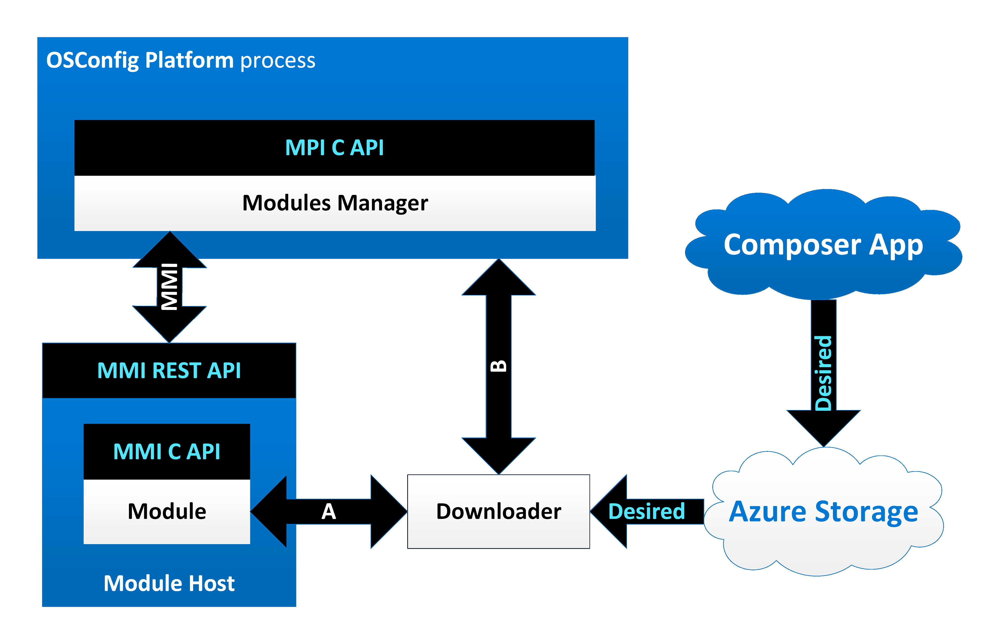
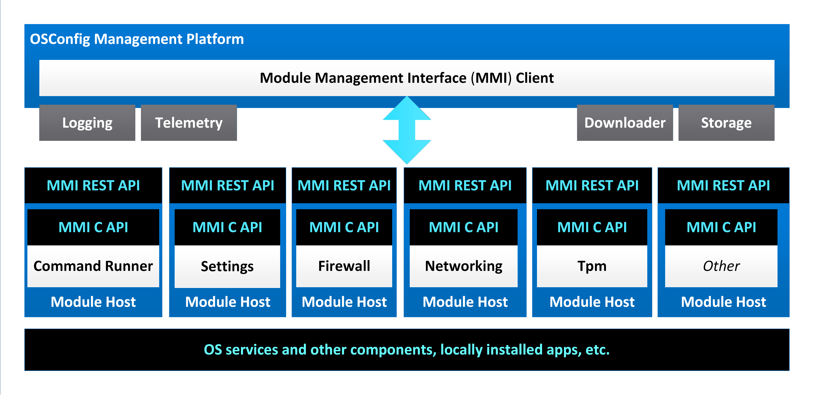

Azure Device OS Configuration (OSConfig) - North Star Architecture
==================================================================
Author: [MariusNi](https://github.com/MariusNi)

# 1. Introduction

Azure Device OS Configuration (OSConfig) is a modular services stack running on a Linux Edge device that facilitates remote Linux IoT device management over Azure (via [Azure PnP](https://docs.microsoft.com/en-us/azure/iot-pnp/overview-iot-plug-and-play), [Digital Twins](https://github.com/Azure/opendigitaltwins-dtdl/blob/master/DTDL/v2/dtdlv2.md), IoT Hub, [IoT Central](https://azure.microsoft.com/en-us/services/iot-central/), Azure Portal/CLI) as well local management (such as from OOBE and ADU, etc.). On the device OSConfig runs alongside [Azure Device Update (ADU)](https://github.com/Azure/adu-private-preview), Defender, Edge Runtime, and others.


This document describes the North Star architecture of this project. Its prime target is to guide the people who develop OSConfig. The doc can be also useful to anyone who is interested to learn about this project.
 
Core design principles for OSConfig are the following:

- Modular, decoupled architecture. 
- Portable and extensible to other management platforms.
- Simple and focused on what is truly needed.
- Not permanently tied to Azure IoT.
- Declarative style device management, Digital Twin-like.

Modular, decoupled architecture means that each layer in OSConfig can be detached from the other OSConfig layers above it and be directly invoked:

- The OSConfig Management Platform can be directly invoked by any management authority or agent over its Management Platform Interface (MPI). The platform is not permanently attached to the OSConfig PnP Agent and OSConfig is not permanently tied to Azure IoT.
- Each OSConfig Management Module can be directly invoked over the module's Management Module Interface (MMI), either in-proc or from separate process. The modules are not permanently attached to the platform.

In general:

- If only a module-specific function is needed, that module can be directly invoked over its MMI.
- If orchestrated functionality of multiple modules is needed, the Platform can be invoked over MPI.
- If remote reach over Azure and IoT Hub is needed, only then the PnP Agent becomes necessary.

The main way of contributing to and extending OSConfig is via developing new [OSConfig Management Modules](modules.md).

# 2. Overall OSConfig Architecture

This diagram shows the current North Star architecture of OSConfig. In this diagram and all other diagrams throughout this document the blue areas represents processes. Each component shown in this diagram is summarized in one of following sections of this document: 


# 3. OSConfig PnP Agent

## 3.1. Introduction

The OSConfig PnP Agent handles communication with IoT Hub. The agent is a thin client running as a daemon (Linux background service) using the IoT Client APIs from the [Azure IoT PnP C SDK](https://github.com/Azure/azure-iot-sdk-c) to connect to the IoT Hub that receives Desired Twin updates from and makes Reported Twin updates to the IoT Hub. 

The agent relies on the [Azure Identity Services (AIS)](https://azure.github.io/iot-identity-service/) to obtain a module identity that allows it to connect to the IoT Hub alongside other locally present PnP agents. 

The agent communicates with the lower Management Platform over the Management Platform Interface (MPI) IPC REST API.


The agent is completely decoupled from the platform and the modules. A new module can be installed, and necessary PnP interface(s) published as part of the OSConfig Model and that will be enough to make OSConfig use the respective module, without the need to recompile the agent or the platform.

## 3.2. AIS Client

The agent  uses the PnP C SDK's HTTP helper APIs to make GET and POST requests to the [Azure Identity Services (AIS)](https://azure.github.io/iot-identity-service/) (identity, key, certificates) to build the device/module identity to (re)connect to the IoT Hub with. 

## 3.3. IoT Hub Client

The agent's  IoT Hub Client parses the Desired Twin payload received from the IoT Hub to separate individual PnP property values. The agent does not attempt to parse the property values. 

## 3.5. MPI Client

The agent implements an MPI Client and it uses it to make Management Platform Interface (MPI) calls to the platform as IPC calls over HTTP and the Unix Domain Sockets (UDS) implemented by the platform.

## 3.6. Desired and Reported Twins

The twins start empty and gradually get filled in with content (desired, from the remote authority and reported, from the device). 

When the agent starts, it receives the full Desired Twin and dispatches that to the platform for modules. From there on, incremental changes of the Desired Twin are communicated to agent, one (full or partial) property at a time. 

In the opposite direction, OSConfig agent periodically updates the Reported Twin with one property value at a time, reading via the platform from the modules. 

# 4. OSConfig Management Platform

## 4.1. Introduction

The OSConfig Management Platform runs in its own daemon process. The platform communicates with the upper agents layer (such as: the OSConfig PnP Agent, Azure Device Update Agent, a TBD OOBE Agent -a concept of OOBE components calling the OSConfig platform, etc.) over the Management Platform Interface (MPI) REST API. 

The platform communicates to the lower modules layer over the Management Modules Interface (MMI) REST API.


 
The platform includes the following main components:

- Management Platform Interface (MPI): MPI as an IPC REST API over HTTP and UDS. This is one of the entry points into the platform for management authorities/agents including OSConfig's own.
- Watcher: monitors for desired configuration file for updates. This is the other entry point into the platform, from both agentless and agent management authorities.
- Orchestrator: receives, orchestrates, serializes requests for modules into the Modules Manager. The management authorities and their agents can make their own MPI requests. The Orchestrator's role is to orchestrate between local and remote management authorities and also help orchestrate for each authority following the Module Interface Model (MIM) contracts and for PnP without modifying passing-through requests in either direction. 
- Modules Manager: receives serialized requests over the MPI C API, dispatches the requests to Module Hosts over the MMI REST API.
- MMI Client: makes MMI REST API calls to Module Hosts over HTTP and UDS. 

The platform also includes following utility/helper components:

- Telemetry: telemetry event writing for the agent, platform, and the modules.
- Logging: a logging library for the agent, platform and modules.
- Storage: a library for secure storage for the platform and the modules that need to persist state.
- Downloader: a library to help modules download files from Azure Storage. 

The platform is completely decoupled from the agent and the modules. The platform can function without the agent, invoked over the MPI. New modules can be installed without changing or recompiling the platform.

## 4.2. Management Platform Interface (MPI)

The Management Platform Interface (MPI) provides a way for the OSConfig Management Platform to be invoked by management authorities/Agents. 

The MPI has two different implementations:

- REST API over Unix Domain Sockets (UDS) for inter-process communication (IPC) with the agents.
- C API for internal in-process communication between the Orchestrator and the Modules Manager.

The MPI REST API is implemented as a Linux Static Library (.a), either alone or combined with the Orchestrator, linked into the platform's main binary, and exporting the REST API over Unix Domain Sockets (UDS). The agent clients make such MPI REST API calls over HTTP.

MPI REST API calls include GET (MpiGet, MpiGetReported) and POST (MpiSet, MpiSetDesired). 

The MPI C API header file is [src/platform/inc/Mpi.h](../src/platform/inc/Mpi.h)

The MPI is almost identical to the MMI, except that: 

- MMI has one extra method, MmiGetInfo, that each Management Module must implement but it is not needed for the MPI
- MPI has the MpiSetDesired and MpiGetReported that the MMI does not have.

For more details on the MMI C API and the similar MmiOpen, MmiClose, MmiFree, MmiSet and MmiGet see the [OSConfig Management Modules](modules.md) specification.

For more about MpiGetReported and MpiSetDesired see the next section.

### 4.2.1. Functional parity between local and remote management

In addition to the common MpiGet and MpiSet an additional pair of MpiGetReported and MpiSetDesired MPI calls are provided so local management authorities such as OOBE can contact the OSConfig Management Platform directly exchanging full or partial desired and reported payload like it happens for the Digital Twins in the following JSON format, including one or many MIM components and MIM objects:  

```
{"desired|reported":{"ComponentName":{"ObjectName":[{"StringSettingName":"some value","IntegerValueName":N,"BooleanValueName":true|false,"IntegerEnumerationSettingName":N,"StringArraySettingName":["StringArrayItemA","StringArrayItemB","StringArrayItemC"],"IntegerArraySettingName":[A,B,C],"StringMapSettingName":{"MapKeyX":"X","MapKeyY":"Y","MapKeyZ":"Z"},"IntegerMapSettingName":{"MapKeyX":X,"MapKeyY":Y,"MapKeyZ":Z}},{...}]},{"ObjectNameZ":{...}}},{"ComponentNameY":{...}}} 
```

Example:

```json
{"desired":{"CommandRunner":{"CommandArguments":{"CommandId":"726","Arguments":"ls", "Action":4}}, "Settings":{"DeviceHealthTelemetryConfiguration":2, "DeliveryOptimizationPolicies":{"PercentageDownloadThrottle":90,"CacheHostSource":2, "CacheHost":"Test cache host","CacheHostFallback":2021}}}} 
```

The RC/DC JSON format follows the MIM JSON format described in the [OSConfig Management Modules](modules.md) specification: one or several MIM JSONs being combined into one "desired"{...} or "reported"{...} JSON envelope. The JSON schema is TBD.

## 4.3. Watcher

The Watcher monitors a local Desired Configuration (DC) file and acts on detected file changes by making in-process MpiSetDesired calls to the Management Platform. The Watcher also makes in-process MpiGetReported calls to the Management Platform and writes the reported configuration to a local Reported Configuration (RC) file. 

The pair of DC and RC files are written in the JSON format summarized in previous section. These files act as local Device Twins. 

To protect against unauthorized access, the DC and RC files are restricted to root user read and write access only.

The  DC and RC files reside under /etc/osconfig/ as `/etc/osconfig/osconfig_desired.json` (the DC file) and `/etc/osconfig/osconfig_reported.json` (the RC file).

## 4.4. Orchestrator

The Orchestrator receives management requests from agents over the Management Platform Interface (MPI) IPC REST API. The Orchestrator combines the requests in a serial sequence that it feeds into the Module Manager to dispatch the requests to the respective Management Modules.

The Orchestrator can be implemented as a Linux Static Library (.a) either alone or combined with the MPI and linked into the platform's main binary.



What the Orchestrator does:

- Receive management requests from one or multiple agent/management authority clients.
- Combines requests into one serial sequence. 
- Skips duplicate requests. For example, a duplicate request to set DeviceHealthTelemetry to Optional.
- Applies a certain order for requests simultaneously arriving from separate authorities per a list of priorities to be created as part of the configuration at /etc/osconfig/osconfig.json. For example, if a request to set DeviceHealthTelemetry to Optional arrives at the same time with a CommandArguments.Action.Shutdown to pipe them in this order. Or: NetworkConnections.DesiredConnectionConfiguration.Action=ChangeIpv4Address results in network connection loss to automatically invoke RollbackConnectionConfiguration.
- Return over the MPI to the agents the module responses from the Modules Manager.
 
What the Orchestrator does not do:

- Make multiple calls in parallel into the Modules Manager (such as over separate threads). The Orchestrator combines multiple parallel pipes into one single serial pipe and feeds MPI requests into the Modules Manager on a single thread.
- Retry failed requests on its own. The Management Modules can internally retry, the upper OSConfig stack, including the Orchestrator, should not automatically retry.
- Create new or modify requests in a way that is incompatible with the MIM contracts with Management Modules.

For PnP:

- The Orchestrator cannot change midway in the platform desired requests from the Twins and cannot change reported requests to the Twins - doing so violates the Twins-MIM contract.
- Once a desired object is set on the Twin, that object gets automatically re-applied to the device until it is corrected on the Twin by the remote authority. OSConfig can reject a desired payload but cannot correct that payload on the Twin. The device cannot change Desired Twin content.

## 4.5. Modules Manager
	
The Modules Manager receives serialized MPI C API requests from the Orchestrator and dispatches the requests over MMI to the appropriate Management Modules in the order they arrive. Also, the Modules Manager returns the modules responses to the Orchestrator. 

The Modules Manager is implemented as a Linux Static Library (.a) exporting the MPI C API. 


What the Module Manager does:

- Searches for a locally installed module. Modules are installed as Dynamically Linked Shared Object libraries (.so) under a predefined location (such as:  /usr/lib/osconfig/ and /usr/local/lib/osconfig). 
- Dynamically loads and unloads the Module Shared Object library (.so) -or- forks and stops the Module Host process to load/unload the module.
- Forwards MPI calls as MMI to the module/Module Host.
- Issues MmiGetInfo to a loaded module/forked Module Host process to identify that module.
- Maintains an internal list of loaded modules/forked Module Hosts.
- (only when modules are loaded in-process by manager) Persists state and if a particular module crashes too many times, decide to not load that module anymore and fail any MPI calls for.  
- When two or more Modules implementing the same components are present, decides which module to load/fork using version info reported by the modules.
- Keeps a module loaded according to the respective module configuration either for the entire duration of the platform process or may decides to unload that module/stop the forked Module Host after a period of inactivity and reload/re-fork when a new request arrives.
- Keeps track of multiple parallel client MPI sessions.

What the Module Manager does not do:

- Orchestrate incoming requests among modules. The Modules Manager dispatches requests in the order they arrive from the Orchestrator. 
- Receive input from multiple callers. The Orchestrator orders the requests from multiple management authorities in one sequence that is feed into the Modules Manager.
- Retry the same MMI request to a module multiple times after a failure. The modules can internally retry, the upper OSConfig stack, including the Modules Manager shall not automatically retry.

## 4.6. Module Host 

The Module Host is a thin executable shell provided by OSConfig that wraps (loads) a Management Module (Dynamically Linked Shared Object library .so) and provides the Unix Domain Sockets (UDS) Module Management Interface (MMI) REST API on behalf of the loaded module which allows the module to be called by any management authority directly, by-passing rest of OSConfig, if needed. The Module Host communicates with the loaded module over the MMI C API that the module implements. 

If the modules are loaded directly in the parent OSConfig process they can communicate with each other with ease (for good and wrong), but also: one module can invade the privacy of other modules (and of the parent), and one module can crash and bring down the entire process. 


Isolating the modules into their own processes makes it harder for them to inter-communicate but also makes them more secure.  The restriction for inter-module communication with the Module Host is compensated by the modules ability to contain multiple MIM components. For example, the Wi-Fi Configuration needs Wi-Fi Certificate Management, and these can be made into two MIM components hosted in the same Wi-Fi Module. 

For more details on the Module Interface Model (MIM) and MIM components see the [OSConfig Management Modules](modules.md) specification.

## 4.7. Module Management Interface (MMI) 

The Management Module Interface (MMI) is almost identical to the Management Platform Interface (MPI), except that: 

- MMI has one extra method, MmiGetInfo. 
- MPI has two additional methods, MpiSetDesired and MpiGetReported, that the MMI does not have.

Like the MPI, the MMI has two different implementations:

- REST API over Unix Domain Sockets (UDS) for inter-process communication (IPC) between the Management Platform (the Modules Manager) and the Module Hosts.
- C API for internal in-process communication between the Modules Hosts and their modules.

The MMI REST API allows modules to be directly called by any management authority if needed. This is also the main channel of communication of modules with the OSConfig Management Platform. This API is implemented as a Linux Static Library (.a) linked into the Module Host binary and exporting the REST API over Unix Domain Sockets (UDS). The MMI Client make such MPI REST API calls over HTTP.

REST API calls include: GET (MmiGet, MmiGetInfo) and POST (MmiSet).

The MMI C API header file is [src/modules/inc/Mmi.h](../src/modules/inc/Mmi.h)

For more details on the MMI C API including MmiGetInfo see the see the [OSConfig Management Modules](modules.md) specification.

## 4.8. Downloader

For requests that involve big data, instead of the actual data being transmitted over the MPI and MMI, download URI paths could be transmitted, pointing to desired configuration files uploaded (for example, on Azure Storage) by a Composer App (editor app for the desired configuration files).

 
 
The Downloader can be a Dynamically Linked Shared Object library (.so) provided by OSConfig for benefit of both OSConfig Management Platform (when downloads go into platform - see B) and (where this is mostly expected to be needed - see A) for Management Modules. The modules would load this dynamic Downloader library in their Module Host processes and invoke the Downloader API.

## 4.9. Storage

The OSConfig Management Platform and the Management Modules may need to persist data, saving it locally on disk to be available across device reboot. To make it easier for module developers, OSConfig can provide a Storage component as a Dynamically Linked Shared Object library (.so)  with an API for secure data storage, retrieval, and erase (where the storage files would be managed by OSConfig).

## 4.10. Logging

OSConfig provides a Logging library component that makes it easy for all OSConfig components to log in a standard fashion to date and time stamped self-rolled log files.

For more details on the Logging library and its use by modules see the [OSConfig Management Modules](modules.md) specification.

## 4.11. Telemetry

The OSConfig Agents and the OSConfig Management Platform have their own Telemetry Providers and write events using [TraceLogging](https://github.com/microsoft/tracelogging). To provide a Telemetry helper library for Modules on top of existing TraceLogging is not yet decided.

## 4.12. Monitoring

Not shown in diagrams is monitoring for device configuration changes. One way monitoring can be done on Linux is via [OSQuery](https://www.osquery.io/) targeted or device wide snapshots deltas. This can be done with an OSQuery Module.

# 5. OSConfig Management Modules

## 5.1. Introduction

Each Management Module typically implements one OS configuration function. OSConfig isolates the module from the [PnP](https://docs.microsoft.com/en-us/azure/iot-pnp/overview-iot-plug-and-play) and the [Digital Twins Definition Language (DTDL)](https://github.com/Azure/opendigitaltwins-dtdl/blob/master/DTDL/v2/dtdlv2.md) protocols and from the Edge authentication with the IoT Hub. OSConfig communicates with the Module over a Module Interface Model (MIM) and the Management Module Interface (MMI) that each module implements. The module developer is not required to learn Azure IoT technologies like PnP,  DTDL, DPS, AIS, etc. and instead can focus on designing the PnP-agnostic MIM and the module implementation.

 

Modules are implemented as Dynamically Linked Shared Object libraries (.so). Each Module runs loaded into its own Module Host process, isolated from the other modules.  The Module Hosts implement the Management Module Interface (MMI) as an IPC REST API and make MMI C API calls into their hosted modules.

In summary, each module must:

- Be a Dynamically Linked Shared Object library (.so).
- Implement the Management Module Interface (MMI) API.
- Model the MMI data following a Module Interface Model (MIM). 
- Log operation and errors via the OSConfig's logging library.
- Be able to function in isolation, all by itself. 
- Not require any additional change in the OSConfig stack.
- Be completely decoupled from other modules and from the rest of the OSConfig stack.

For more information about modules see the [OSConfig Management Modules](modules.md) specification.
 
## 5.2. Module Interface Model (MIM)

The Module Interface Model (MIM) is a PnP/DTDL-agnostic model  that is composed of components, objects, and settings. A module that can be described by a set of components, objects and settings can be translated to PnP and DTDL and still be generic enough so it could be reused for other platforms. 

The Module Management Interface (MMI) is used to transport desired and reported object payloads (to and from the module) that follow the MIM. 

This model assumes a declarative style of communication between the upper layer and the module, where the desired and reported configuration of the device is communicated in bulk (for PnP this configuration being stored on the Twins), not a procedural style with multi-step negotiation.

For more information about the MIM see the [OSConfig Management Modules](modules.md) specification.

## 5.3. OSQuery Module

The OSQuery Module implements an adapter for [OSQuery](https://www.osquery.io/). This module can support multiple MIM components and PnP interfaces that are read-only (all reported, no desired configuration) and leverage OSQuery to retrieve the respective configuration from the device. To be decided.