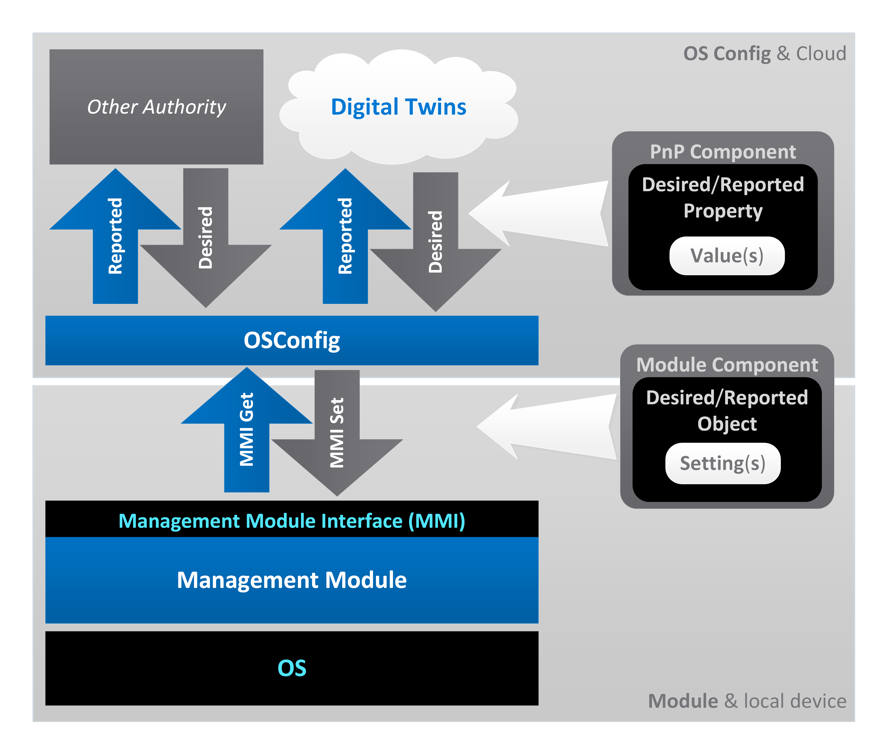

OSConfig Management Modules 
===========================
Author: [MariusNi](https://github.com/MariusNi)

# 1. Introduction

Azure Device OS Configuration (OSConfig) is a modular services stack running on a Linux IoT Edge device that facilitates remote device management over Azure as well from local management authorities. 

OSConfig contains a PnP Agent, a Management Platform (Modules Manager) and several Management Modules.

The main way of contributing to and extending OSConfig is via developing new Management Modules.

Each Management Module typically implements one device OS configuration function. OSConfig isolates the module from the PnP and Digital Twins Definition Language (DTDL) protocols and from the Edge authentication with the IoT Hub. OSConfig communicates with the module via the Module Interface Model (MIM) and the Management Module Interface (MMI) API that each module implements. The module developer is not required to learn Azure IoT technologies like PnP,  DTDL, DPS, AIS, etc. and instead can focus on designing the PnP-agnostic MIM and implement the module. If needed, the MIM can then be easily translated to DTDL with minimal changes.
 
This document describes the OSConfig Management Modules and it's meant to serve as a guide for the design and development of such modules. 

For more information on OSConfig see the [OSConfig North Star Architecture](architecture.md) and [OSConfig Roadmap](roadmap.md) documents.

# 2. Architecture Overview


This diagram shows the overall OSConfig North Star architecture. Not all components shown in this diagram are currently available. 

# 3. Module Interface Model (MIM)

## 3.1. Introduction

This section describes the PnP/DTDL-agnostic Module Interface Model (MIM). 

The MIM describes the device configuration the module can perform and defines the valid payload for Management Module Interface (MMI) Get/Set API calls.  

Each module must have its own MIM. Typically development of a new mlodule starts with the MIM. Once the MIM is complete the module can be implemented to follow that MIM.

The MIM is composed by one or more MIM components, each component containing one or more MIM objects, each object being either desired or reported and containing one or several MIM settings. In other words a MIM can be described as lists of components, objects and settings.

MIM can be directly translated to DTDL: MIM components can be translated to PnP interfaces, MIM objects can be translated to PnP properties, MIM settings can be translated to PnP property values. Such DTDL (obtained from MIM translation) is guaranteed to be supported by OSConfig. In general, MIM can always be translated to DTDL but DTDL cannot always be translated to MIM. 

A MIM can also be translated to other object models. For example, a MIM could be translated to a C++ class framework (each component becoming a namespace, each object a class, each setting a class member).

This model assumes a declarative style of communication between the upper layers and the module, where the desired and reported configuration of the device is communicated at once (for PnP this configuration being stored on the Digital Twin), not a procedural style with multi-step negotiation.

- Declarative style: the model describes the desired state (what), the platform decides how to get there. 
- Procedural style: the model relies on programmatic step-by-step negotiation of what and how. 

For PnP, the Twins start empty and gradually get filled in with content (desired, from the remote operator and reported, from the device). When the OSConfig starts, it receives the full desired Twin and dispatches that to modules. From there on, incremental changes of the desired Twin are communicated to OSConfig (and the Modules), one (possibly partial, just the changed settings) object at a time. In the opposite direction, OSConfig periodically updates the reported Twin with one MIM object at a time, reading from the Modules. Modules can also have their own MIM-specified actions to request the update of a reported MIM object (example: RefreshCommandStatus Action for CommandRunner.CommandArguments to update CommandRunner.CommandStatus for a particular command).

### 3.1.1. MIM Components 

A MIM Component captures one specific OS configuration function, such as for example: running shell commands, configuring Wi-Fi, managing certificates, etc. 

MIM components can be translated to PnP interfaces (or to C++ namespaces etc).

Modules in general only need to contain only one MIM component. Sometimes, a second MIM component could be needed. For example, for Wi-Fi one MIM component could be Wi-Fi Configuration and a second MIM component in support of the first but still separate could be Wi-Fi Certificates.

Each MIM component is defined by and contains a set of MIM objects. Each new version of a MIM component must have a name that's different from the previous versions of the same MIM component.

Example of an existing OSConfig MIM component: CommandRunner.

### 3.1.2. MIM Objects

A MIM object captures an OS configuration state or function. For example: result of a command, a new Wi-Fi Profile, etc. 

MIM objects can be translated to PnP properties (or to C++ classes etc).

There are two types of PnP properties:
- Readable, holding Reported Twin values. These properties are exclusively updated from the device and seen as read-only from the IoT Hub.
- Writeable, holding Desired Twin values. These properties are exclusively updated from the IoT Hub. The device can reject an update request but cannot update such property.

Same as PnP properties, the MIM objects (together with the settings they contain) are unidirectional, either reported or desired, not both.  For writeable settings, desired objects normally may be paired with reported objects. For read-only settings there can be only reported objects. There also could be desired objects without reported counterparts. Once the desired and reported objects are modeled, the module must adhere to this model (report reported, accept desired) and respect it. 

When the desired MIM object is distinctly different from its reported MIM object the two objects can be linked together (to be able to reference each other) via a common MIM setting. For example, the Command Runner OSConfig component's desired CommandArguments object is linked to the matching reported CommandStatus object via the CommandId MIM setting that both contain. 

Each MIM object contains one or multiple MIM settings, either in a single instance or in multiple instances, as a array object. 

An array MIM object is a MIM object with its list of MIM settings repeated a variable number of times as items into an array.

When a MIM object contains just one MIM setting, that object and setting share the same name and for PnP are translated to a simple PnP property.

Example of an MIM object that contains multiple MIM settings:

```JSON
{ 
  "name": "TpmStatus", 
  "type": "MimObject", 
  "desired": false,
  "schema": {
     "type": "enum",
     "valueSchema": "integer",
     "enumValues": [
       { 
         "name": "Unknown",
         "enumValue": 0
       },
       {
         "name": "TpmDetected",
         "enumValue": 1
       },
       {
         "name": "TpmNotDetected",
         "enumValue": 2
       }
     ]
   }
}
```

Example of a simple MIM object that contains a single MIM setting:

```JSON
{ 
  "name": "ServiceUrl", 
  "type": "MimObject", 
  "desired": false,
  "schema": "string"
}
```

Example of an array MIM object:

```JSON
{
  "name": "FirewallRules",
  "type": "MimObject",
  "desired": true,
  "schema": {
    "type": "Array",
    "elementSchema": {
      "type": "Object",
      "fields": [
        {
          "name": "Direction",
          "schema": "string"
        },
        {
          "name": "Target",
          "schema": "string"
        },
        {
          "name": "Protocol",
          "schema": "string"
        },
        {
          "name": "IpAddress",
          "schema": "string"
        },
        {
          "name": "Port",
          "schema": "string"
        }
      ]
    }
  }
}
```

### 3.1.3 MIM Settings

MIM Settings translate to PnP property values of following types supported by both DTDL and OSConfig: 

- Character string (UTF-8) 
- Integer
- Boolean
- Enumeration of integers
- Array of strings
- Array of integers
- Map of strings
- Map of integers

Same as objects, settings can be either reported or desired. All MIM settings within a MIM object share the same parent object's type (either reported or desired). 

Example of an MIM setting of string type:

```JSON
{
  "name": "CommandId",
  "schema": "string"
}
```

Example of an MIM setting of integer type:

```JSON
{
  "name": "Timeout",
  "schema": "integer"
}
```

Example of an MIM setting of boolean type:

```JSON
{
  "name": "SingleLineTextResult",
  "schema": "boolean"
}
```

Example of an MIM setting of enumeration of integers type:

```JSON
{
  "name": "CurrentState",
  "schema": {
    "type": "enum",
    "valueSchema": "integer",
    "enumValues": [
      { 
        "name": "Unknown",
        "enumValue": 0
      },
      {
        "name": "Running",
        "enumValue": 1
      },
      {
        "name": "Succeeded",
        "enumValue": 2
      },
      {
        "name": "Failed",
        "enumValue": 3
      },
      {
        "name": "TimedOut",
        "enumValue": 4
      },
      {
        "name": "Canceled",
        "enumValue": 5
      }
    ]
  }
}
```

Example of a MIM seting of array of strings type:

```JSON
{
  "name": "FirewallFingerprints",
  "schema": {
    "type": "Array",
    "elementSchema": "string"
  }
}
```

Example of a MIM seting of map of strings type:

```JSON
{
  "name": "FirewallFigerprins",
  "schema": {
    "type": "Map",
    "mapKey": {
      "name": "FigerprintName",
      "schema": "string"
    },
    "mapValue": {
      "name": "FingerprintValue",
      "schema": "string"
    }
  } 
}
```

## 3.2. Describing the Module Interface Model (MIM)

MIM names (for components, objects, settings and setting values, including map key names) may only contain the characters 'a'-'z', 'A'-'Z', '0'-'9', and '_' (underscore), and must match the following regular expression: 

```
^[a-zA-Z](?:[a-zA-Z0-9_]*[a-zA-Z0-9])?$
```

Value types can be "object", "string", "integer", "boolean", "enum" (enumeration of "integer" values), "array" (array of "integer" or "string" values), "map" (map of "integer" or "string" values).

The number of MIM components, objects and settings translated to PnP affect the size of the device's Twin, which is limited. Thus it is important to try to describe a new module with the smallest possible number and size of MIM components, objects, and settings.
 
### 3.2.1. Describing the MIM via lists and tables

The model is composed by a list of components, several lists (one for each component) of desired or reported objects, several lists (one for each object) of settings, and one table per seting describing that setting. 

1. List the component(s) for the module. A module should have only one or two components.
1. For each component, list the readable and writeable object(s) contained within this component. 
1. For each object, list the setting(s) contained within this object. 
1. For each object, answer if this is an array object (where all settings repeat a variable number of times as items into an array) or not. 
1. Describe each setting with answers to the following questions:
    1. What is the setting name? The name of the setting, in CamelCase.
    1. What is the access: desired or reported for the seting?
    1. What does the setting? A short description of the setting (what the setting does, in few words).
    1. What is the value type for the setting? Answer can be: boolean, integer, enumeration of integers, character string (UTF-8).
    1. What are the supported values? Describe supported values, including minimum and maximums if any, valid enumeration values, maximum length for string if any, etc.
    1. Does this setting need to link two objects together (desired and reported), and if so, how?
    1. Does this setting depend on any other setting in this or another object? List what. 
    1. Is this setting required or optional? Can this setting be skipped at run time to be reported/updated?

Example: desired setting Action of CommandArguments: 

Question | Answer
-----|-----
Component | CommandRunner
Object | CommandArguments
Setting | Action
Access | Desired (no matching reported setting)
Description | The action for this command
Value type | Enumeration of integers
Supported values | 0 (None), 1 (Reboot), 2 (Shutdown), 3 (RunCommand), 4 (RefreshCommandStatus), 5 (CancelCommand)
Links two objects | No
Relation to other settings | RunCommand runs the command described by the Arguments setting value of this object. RefreshCommandStatus requests the CommandStatus object of this component to be refreshed for the CommandId setting value of this object.
Required | Yes

Example: setting CommandId links desired object CommandArguments and reported object CommandStatus:

Question | Answer
-----|-----
Component | CommandRunner
Object | CommandArguments
Setting | CommandId
Access | Desired (matching CommandStatus.CommandId as reported)
Description | The identifier for this command, as provided with the command request
Value type | String
Supported values | Any UTF-8 character string up to 256 bytes long.
Links two objects | Yes. CommandArguments with CommandStatus. The setting value identifies a command and links this desired CommandArguments object with the reported CommandStatus object.
Relation to other settings | None
Required | Yes

Question | Answer
-----|-----
Component | CommandRunner
Object | CommandStatus
Setting | CommandId
Access | Reported
Description | The identifier for this command, originally provided via a CommandArguments object, now reported back to indicate the command this result (status) is for.
Value type | String
Supported values | Any UTF-8 character string up to 256 bytes long.
Links two objects | Yes. CommandArguments with CommandStatus. The setting value identifies a command and links this reported CommandStatus object with the respective desired CommandArguments object.
Relation to other settings | None
Required | Yes

Example: fictive setting FooPolicy, both desired and reported, optional:

Question | Answer
-----|-----
Component | FooPolicies
Object | DesiredFooPolicies
Setting | FooPolicy
Access | Desired (matching ReportedFooPolicies.FooPolicy as reported)
Description | A fictive desired policy
Value type | String
Supported values | Any UTF-8 character string up to 256 bytes long.
Links two objects | No
Relation to other settings | Related to reported ReportedFooPolicies.FooPolicy
Required | No

Question | Answer
-----|-----
Component | FooPolicies
Object | ReportedFooPolicies
Setting | FooPolicy
Access | Reported
Description | A fictive reported policy
Value type | String
Supported values | Any UTF-8 character string up to 256 bytes long.
Links two objects | No
Relation to other settings | Related to (set via) DesiredFooPolicies.FooPolicy
Required | No

Example: fictive setting ReadOnlyFooPolicy which is only reported and is required:

Question | Answer
-----|-----
Component | FooPolicies
Object | ReportedFooPolicies
Setting | ReadOnlyFooPolicy
Access | Reported
Description | A fictive read-only reported policy
Value type | String
Supported values | Any UTF-8 character string up to 256 bytes long.
Links two objects | No
Relation to other settings | None
Required | Yes

A MIM can be completely described by lists and tables as described in this section and also in JSON.

### 3.2.2.  MIM JSON 

Each module must have its own MIM JSON saved to the [src/modules/mim/](../src/modules/mim/) in a JSON file with the same name as the module SO binary.

The MIM JSON schema is at [src/modules/schema/mim.schema.json](../src/modules/schema/mim.schema.json).

Sample MIM JSON:

```JSON
{
  "name": "ModelName",
  "type": "MimModel",
  "contents": [
    {
      "name": "ComponentName",
      "type": "MimComponent",
      "contents": [
        {
          "name": "ObjectName",
          "type": "MimObject",
          "desired": [true,  false],
          "schema": {
            "type": "object",
            "fields": [
              {
                "name": "StringSettingName",
                "schema": "string"
              },
              {
                "name": "IntegerSettingName",
                "schema": "integer"
              },
              {
                "name": "BooleanSettingName",
                "schema": "boolean"
              },
              {
                "name": "IntegerEnumerationSettingName",
                "schema": {
                  "type": "enum",
                  "valueSchema": "integer",
                  "enumValues": [
                    {
                      "name": "None",
                      "enumValue":  0
                    },
                    {
                      "name": "EnumValue1",
                      "enumValue":  1
                    }
                  ]
                }
              },
              {
                "name": "StringsArraySettingName",
                "schema": { 
                  "type": "Array",
                  "elementSchema": "string"  
                }
              },
              {
                "name": "IntegerArraySettingName",
                "schema":  {
                  "type": "Array",
                  "elementSchema": "integer"  
                }
              },
              {
                "name": "StringMapSettingName",
                "schema": {
                  "type": "Map",
                  "mapKey":  {
                    "name": "KeyName",
                    "schema": "string"
                  },
                  "mapValue": {
                    "name": "MapValue",
                    "schema": "string"
                  }
                }
              },
              {
                "name": "IntegerMapSettingName",
                "schema": {
                  "type": "Map",
                  "mapKey":  {
                    "name": "KeyName",
                    "schema": "string"
                  },
                  "mapValue": {
                    "name": "MapValue",
                    "schema": "integer"
                  }
                }
              }
            ]
          }
        },
        {
          "name": "ArrayObjectName",
          "type": "MimObject",
          "desired": [true,  false],
          "schema": {
            "type": "Array",
            "elementSchema": {
              "type": "Object",
              "fields": [
                {
                  "name": "StringSettingName",
                  "schema": "string"
                },
                {
                  "name": "IntegerSettingName",
                  "schema": "integer"
                },
                {
                  "name": "BooleanSettingName",
                  "schema": "boolean"
                },
                {
                  "name": "IntegerEnumerationSettingName",
                  "schema": {
                    "type": "enum",
                    "valueSchema": "integer",
                    "enumValues": [
                      {
                        "name": "None",
                        "enumValue": 0
                      },
                      {
                        "name": "EnumValue1",
                        "enumValue": 1
                      }
                    ]
                  }
                },
                {
                  "name": "StringsArraySettingName",
                  "schema": { 
                    "type": "Array",
                    "elementSchema": "string"
                }
                },
                {
                  "name": "IntegerArraySettingName",
                  "schema":  {
                    "type": "Array",
                    "elementSchema": "integer" 
                  }
                },
                {
                  "name": "StringMapSettingName",
                  "schema": {
                    "type": "Map",
                    "mapKey":  {
                      "name": "KeyName",
                      "schema": "string"
                    },
                    "mapValue": {
                      "name": "MapValue",
                      "schema": "string"
                    }
                  }
                },
                {
                  "name": "IntegerMapSettingName",
                  "schema": {
                    "type": "Map",
                    "mapKey":  {
                      "name": "KeyName",
                      "schema": "string"
                    },
                    "mapValue": {
                      "name": "MapValue",
                      "schema": "integer"
                    }
                  }
                }
              ]
            }
          }
        },
        {
           "name": "ObjectNameZ"
        }
      ]
    },
    {
      "name": "ComponentNameY"
    }
  ]
}
```

MIM JSON examples:
- CommandRunner: two MIM objects, CommandArguments (desired) and CommandStatus (reported), linked together by a common setting, CommandId: [CommandRunner MIM](../src/modules/mim/commandrunner.json)
- Tpm: three simple reported MIM objects, each containing a single setting: [Tpm MIM](../src/modules/mim/tpm.json)

### 3.2.3 Serialized MIM payload at run-time

The following would be the payload serialized at runtime for the entire MIM (wrapping the object values that the MMI handles): 

```
{"desired|reported":{"ComponentName":{"ObjectName":[{"StringSettingName":"some value","IntegerValueName":N,"BooleanValueName":true|false,"IntegerEnumerationSettingName":N,"StringArraySettingName":["StringArrayItemA","StringArrayItemB","StringArrayItemC"],"IntegerArraySettingName":[A,B,C],"StringMapSettingName":{"MapKeyX":"X","MapKeyY":"Y","MapKeyZ":"Z"},"IntegerMapSettingName":{"MapKeyX":X,"MapKeyY":Y,"MapKeyZ":Z}},{...}]},{"ObjectNameZ":{...}}},{"ComponentNameY":{...}}} 
```

MmiSet and MmiGet only use the object portions of this payload. Such as:

```
{"StringSettingName":"some value","IntegerValueName":N,"BooleanValueName":true|false,"IntegerEnumerationSettingName":N,"StringArraySettingName":["StringArrayItemA","StringArrayItemB","StringArrayItemC"],"IntegerArraySettingName":[A,B,C],"StringMapSettingName":{"MapKeyX":"X","MapKeyY":"Y","MapKeyZ":"Z"},"IntegerMapSettingName":{"MapKeyX":X,"MapKeyY":Y,"MapKeyZ":Z}},{...}]} 
```

or:

```
"some value"
```

or:

```
N
```

or:

```
true|false
```

or:

```
["StringArrayItemA","StringArrayItemB","StringArrayItemC"]
```

or:

```
[A,B,C]
```

or:

```
{"MapKeyX":"X","MapKeyY":"Y","MapKeyZ":"Z"}
```

Etc.

Example of serialized JSON payload for two CommandRunner.CommandArguments desired object instances plus one instance of Settings with its desired objects:

```JSON
{"desired":{"CommandRunner":{"CommandArguments":{"CommandId":"A","Arguments":"date","Action":4}},"Settings":{"DeviceHealthTelemetryConfiguration":2,"DeliveryOptimizationPolicies":{"PercentageDownloadThrottle": 55,"CacheHostSource": 0,"CacheHost": "abc","CacheHostFallback":2022}},"CommandRunner":{"CommandArguments":{"CommandId":"B","Arguments":"ls","Action": 4}}}}
```

# 4. Management Modules Interface (MMI)

A simplified diagram shows the desired and reported configuration requests exchanged between Digital Twin in Azure via the local OSConfig and module over the Management Module Interface (MMI): 


 
Each module must be a Linux Dynamically Linked Shared Object library (.so) implementing the MMI. The MMI transports the MIM object payloads of settings for the module component(s). 

For the current version OSConfig continues to run as a single process, with modules loaded in-proc. In a future version OSConfig could split in two processes, one for the Agent and the other for the Platform. In a further future version modules could be isolated to run each into their own processes, via an executable shell provided by OSConfig. 

In general, any process can load a module and communicate to it over the MMI. The module developer shall not assume that the module will be loaded by a certain process or that will be only invoked over PnP and IoT Hub.

The MMI is a simple C API and includes the calls described in this section. 

The MMI header file is [src/modules/inc/Mmi.h](../src/modules/inc/Mmi.h)

## 4.1. MmiGetInfo

MmiGetInfo returns information about the module to help the client to correctly identify it. MmiGetInfo may be called at any time and is typically called immediately after the module is loaded by the client, before MmiOpen. MmiGetInfo must succeed called at any time while the module is loaded.

MmiGetInfo takes as input argument the name of the client (the module use that name to identify the caller, same as passed to MmiOpen) and returns via output arguments a JSON payload and size of payload in bytes plus MMI_OK if success, NULL and respectively 0 as payloadSizeBytes plus an error code if failure, same as MmiGet. The caller must free the memory for payload calling MmiFree. 

```C
// Not null terminated, UTF-8, JSON formatted string
typedef char MMI_JSON_STRING;

int MmiGetInfo(
    const char clientName,
    MMI_JSON_STRING payload,
    int payloadSizeBytes);
```

The following values can be present in the JSON payload response. The values not marked (optional) are mandatory. Optional values that are implemented are required to follow the following guideline:

Field | Type | Description
-----|-----|-----
Name | String | Name of the module 
Description | String | Short description of the module
Manufacturer | String | Name of the module manufacturer
VersionMajor | Integer | Major (first) version number of the module
VersionMinor | Integer |  Minor (second) version number of the module
VersionPatch | Integer | (optional) Patch (third) version number of the module
VersionTweak | Integer | (optional) Tweak (fourth) version number of the module
VersionInfo | String | Short description of the version of the module
Components | List of strings | The names of the components supported by the module, same as used for the componentName argument for MmiGet and MmiSet. Modules are required to support at least one component. 
Lifetime | Enumeration of integers | One of the following values: 0 (Undefined), 1 (Long life/keep loaded): the module requires to be kept loaded by the client for as long as possible (for example when the module needs to monitor another component or Hardware), 2 (Short life): the module can be loaded and unloaded often, for example unloaded after a period of inactivity and re-loaded when a new request arrives
LicenseUri | String | (optional) URI path for license of the module
ProjectUri | String | (optional) URI path for the module project
UserAccount | Integer | (optional) The Linux UID of the user account the module needs to run as. One of the UIDs in the local /etc/passwd. 0 is root. Note that UIDs can change (be moved). Root (0) is default.

In addition to the values in the above table the module manufacturer can add their own values.

A JSON schema of the MmiGetInfo payload response is at [MmiGetInfo JSON schema](../src/modules/schema/mmi-get-info.schema.json)

## 4.2. MmiOpen

MmiOpen starts a new client session with the module. MmiOpen receives as an input argument the name of the client (the module use that name to identify the caller) and the maximum size in bytes for object payload values supported by the client (0 if unlimited). For OSConfig this name will be same as used for the IoT Hub (```Azure OSConfig M;A.B.C.YYYYMMDD``` where ```M``` is the DTDL model version, ```A.B.C``` is the version number and ```YYYYMMDD``` is the build date of OSConfig). On success, MmiOpen returns a newly created handle to identify this session. The handle is a module-specific opaque handle (where the module can hide a C structure or C++ class that identifies the current session) to be used for subsequent calls. On failure, MmiOpen returns NULL.

```C
typedef void* MMI_HANDLE;

MMI_HANDLE MmiOpen(
    const char* clientName,
    const unsigned int maxPayloadSizeBytes);
```

## 4.3. MmiClose

MmiClose ends a client session with the module. MmiClose receives as an input argument the handle returned by a previous MmiOpen call. No further calls with that handle can be made after this call.

```C
void MmiClose(MMI_HANDLE clientSession);
```

## 4.4. MmiSet

MmiSet takes as input arguments a handle returned by MmiOpen, the name of the component (for OSConfig this will be the name of the PnP interface/component, e.g. "CommandRunner"), the name of the object (for OSConfig this will be the be PnP property name, e.g. "CommandArguments"), the desired object payload formatted as JSON and not null terminated UTF-8 character string  and the length (size) in bytes of the JSON payload (without null terminator). The module can use the clientSession handle (module specific, could be a C structure or C++ class) to give context to the call or can ignore it. 

The objectName and payload must must match a desired MIM object from the componentName MIM component and present in the module's MIM. There can only be one single MIM object per MmiSet call. Modules must not accept MmiSet calls that are not following their MIM precisely.

```C
int MmiSet(
    MMI_HANDLE clientSession,
    const char* componentName,
    const char* objectName,
    const MMI_JSON_STRING payload,
    const int payloadSizeBytes);
```

On completion MmiSet returns MMI_OK (0) if success or an error code defined in errno.h.

```C
// Plus any error codes from errno.h
#define MMI_OK 0
```

The payload argument contains a JSON formatted, not null terminated UTF-8 string, that contains one or multiple values in the following format:

- Integer payload example: ```"123"```
- String payload example: ```"This is a test"```
- Boolean payload example: ```"true"```
- Complex payload example combining all the above as fields into same object payload: ```"{"valueOne":123,"valueTwo":"This is a test.","valueThree":true}"``` where "valueOne", "valueTwo" and "valueThree" are the respective field names.

OSConfig will not attempt to parse and validate the payload and payloadSizeBytes arguments. It is the responsability of the respective module to do this and return errors if appropriate. Modules must also validate the clientSession, componentName and objectName arguments against invalid values.

The maximum size of payload will be limited to the size specified via MmiOpen if that's a non-zero value (0 meaning unlimited). For OSConfig the payload of the PnP requests translated into MMI calls must be size limited (the size of the Twin, the Azure clone of the device, is limited) and a 4KB (4,096 bytes) limit was chosen but this may change in the future. Other platforms calling into the module may not have such a limitation. If needed, the module must enforce this maximum limit and reject MmiSet calls with payloadSizeBytes greater than this maximum value (unless than maximum value is 0, unlimited).

## 4.5. MmiGet

MmiGet takes as input arguments a handle returned by MmiOpen, the name of the component, the name of the object, and returns via output arguments the reported object payload formatted as JSON (same format as for MmiSet), the size of value size and MMI_OK if success, NULL, 0 and an error code defined in errno.h if failure. On success, the caller requests the module to free the memory for the JSON payload with MmiFree.

The objectName and payload must must match a reported MIM object from the componentName MIM component and present in the module's MIM. There can only be one single MIM object per MmiGet call. Modules must not return to MmiGet payloads that are not following their MIM precisely.

```C
int MmiGet(
    MMI_HANDLE clientSession,
    const char* componentName,
    const char* objectName,
    MMI_JSON_STRING* payload,
    int* payloadSizeBytes);
```

Modules must validate on input the clientSession, componentName and objectName arguments against invalid values. For example, a module that implements a single MIM component with just one MIM reported object needs to validate that the requested component and object names are supported ones in order not to report their reported object data for a different component or object.

If the module has no data to report the module must still return valid payload that contains default values (such as empty strings). The module must not return MMI_OK with null payload or payload size of 0.

## 4.6. MmiFree

Frees memory allocated by module for the payload returned to MmiGetInfo and MmiGet:

```C
void MmiFree(MMI_JSON_STRING payload);
```

# 5. Installation

Modules are installed as Dynamically Linked Shared Object libraries (.so) under /usr/lib/osconfig/. Each module reports its version at runtime via MmiGetInfo.

Reported MIM objects for the module are registered via the OSConfig general configuration file at /etc/osconfig/osconfig.json. 

For example, to add a MyComponent.MyReportedObject to the list to be reported:

```JSON
{
  "Reported": [
    {
      "ComponentName": "CommandRunner",
      "ObjectName": "CommandStatus"
    },
    {
      "ComponentName": "MyComponent",
      "ObjectName": "MyReportedObject"
    }
  ]
}
```

OSConfig periodically reports data at a default time period of 30 seconds. This interval period can be adjusted between 1 second and 86,400 seconds (24 hours) via the same configuration file:

```JSON
{ 
    "ReportingIntervalSeconds": 30
} 
```

Once the module's SO binary is copied to /usr/lib/osconfig/ and the reported objects if any are registered in /etc/osconfig/osconfig.json, restart or refresh OSConfig to pick up the configuration change:

```
sudo systemctl kill -s SIGHUP osconfig.service
```

# 6. Persistence, Retry, Wait

Modules may need to save data to files to persist across device restart. Any persisted files must be access-restricted to be written by root account only and must be deleted when no longer needed. The modules must not save to such files any personal, user or device, identifying data. The files may be encrypted (encryption is optional). 

A future version of OSConfig may provide modules with a Storage utility that could be used by Modules instead of their own persistence files. 

Modules may also need to retry failed OS configuration operations or wait. Persisting state can help modules execute retry and wait over machine restarts.

# 7. Orchestration

The OSConfig Platform will orchestrate the requests received from the various agents (including the OSConfig PnP Agent) and management authorities into an ordered sequences of MMI calls that will be communicated to each module to execute.

# 8. Versioning

Modules must report their version via MmiGetInfo. OSConfig will use this version to decide which module to load in case that multiple versions of the same module are present under /usr/lib/osconfig/. 

Each module must be compliant with its Module Interface Model (MIM). New  versions of the Modules keeping the same MIM must increment their version numbers. When the MIM needs to change, the component names can be changed and/or components with new names be added. 

# 9. Packaging

Modules can be packaged standalone in their own packages or together with OSConfig in one package. 

# 10. Telemetry 

Each module is responsible of its own telemetry. The modules must not emit any personal, user or device, identifying (PII) data. 

# 11. Logging

Modules can log via the logging library provided by OSConfig to log files under /var/log/ where all other OSConfig logs are found. To help the device administrator collect all OSCOnfig logs the module should use a log name that matches the rest of the OSConfig logs: ```/var/log/osconfig_*modulename*.log```.

Modules can log MIM component names and MIM object names. Modules must not log MIM setting values unless full logging is enabled. In general, the modules must not log any personal, user or device, identifying (PII) data. 

## 11.1. Logging library

OSConfig provides a static logging library that modules can use. 
 
To enable and use logging via this library, modules must use the following calls:

Call | Arguments | Returns | Description
-----|-----|-----|-----
OpenLog | The name of the log and of the rollover backup log. These names must be "/var/log/osconfig_*modulename*.log" and "/var/log/osconfig_*modulename*.bak" respectively | A OSCONFIG_LOG_HANDLE handle | Called when the module starts to open the log 
CloseLog | A OSCONFIG_LOG_HANDLE handle | None | Called when the module terminates to close the log
IsFullLoggingEnabled | None | Returns true if full logging is enabled, false otherwise | Checks if full logging is enabled
OsConfigLogInfo | The OSCONFIG_LOG_HANDLE handle plus printf-style format string and variable list of arguments | None | Writes an informational trace to the log
OsConfigLogError | The OSCONFIG_LOG_HANDLE handle plus printf-style format string and variable list of arguments | None | Writes an error trace to the log

The Logging library header file: [src/common/logging/Logging.h](../src/common/logging/Logging.h)

## 11.2. Enabling full logging

Full logging can be temporarily enabled by the module developer for debugging purposes. Generally it is not recommended to run OSConfig with full logging enabled. 

To enable full logging, edit the OSConfig general configuration file at /etc/osconfig/osconfig.json and set there the integer value named "FullLogging" to a non zero value (such as 1) to enable full logging and to 0 for normal logging:

```JSON
{ 
    "FullLogging":0 
} 
```

To make OSConfig apply the change, restart or refresh OSConfig:

```
sudo systemctl kill -s SIGHUP osconfig.service
```

## 11.3. Logging during MMI calls

Modules can log as necessary informational and error traces during all MMI calls except MmiGet: MmiOpen, MmiClose, MmiFree and MmiSet.

During MmiGet modules should only log in case of error (no information traces) and only when full logging is enabled (when IsFullLoggingEnabled returns true). This is because MmGet is periodically called and same traces can fill the module log, obscuring other traces.

# 12. Handling multiple client sessions

OSConfig Modules can be invoked to execute multiple sessions in parallel. Each MmiOpen opens a new session with that client. Each MmiClose closes one session (other sessions may remain open). At any time during a module instance life there may be multiple clients connected to the module and  there may be multiple open sessions from each client.

The code for a module can be split into a static library and a shared object (SO) dynamic library. This section describes one optional pattern which can help a module to support multiple sessions. 

## 12.1. Module Static Library

The static library implements one upper C++ class: ModuleObject. This class contains common code to all ModuleObject instances placed in a base class. Each ModuleObject instance represents one client session and implements:

- ModuleObject::Get with same signature as MmiGet
- ModuleObject::Set with same signature as MmiSet
- Public constructor and destructor.

Each ModuleObject instance knows about its client session only.

## 12.2. Module Shared Object (SO)

The SO component of the module implements the MMI functions, with C signatures and C|C++ implementations.

Following functions are global for all sessions:

- MmiGetInfo: returns static info about the module.
- MmiOpen: allocates a new ModuleObject, returns a pointer to it as MMI_HANDLE and forgets it.
- MmiClose: casts the MMI_HANDLE to ModuleObject and deletes that.
- MmiFree: frees specified memory.

Following functions are session specific. They cast the session handle to obtain the ModuleObject and then on that object invoke the corresponding method:

- MmiGet: calls ((ModuleObject)clientSession)->Get
- MmiSet: calls ((ModuleObject)clientSession)->Set
- ModuleObject::Get has same arguments and return as MmiGet
- ModuleObject::Set has same arguments and return as MmiSet

# 13. Command Line Module Utility

To facilitate development disconnected from Azure IoT and rest of OSConfig stack a command line Module Utility may be provided in the future as a console executable to load and validate the module. 

The command line module utility app will load a module and provide it with an executable layer, allowing the module to be invoked locally over its MMI and MIM in a Linux environment, without the need of rest of OSConfig stack, PnP, IoT Hub, Azure Portal,  etc. 


# 14. Publishing DTDL for the module

# 14.1. Introduction

Modules can work invoked by any client over their MMI. When a module works with the rest of the OSConfig stack and in particular with the OSConfig PnP Agent, in order to allow remote management over Azure and IoT Hub, the module needs to have one or more PnP interfaces (one for each MIM component) published via the public [OSConfig DTDL Model](https://github.com/Azure/iot-plugandplay-models/tree/main/dtmi/osconfig). This allows applications such as [Azure IoT Explorer](https://github.com/Azure/azure-iot-explorer) to display personalized user interface to help the operator request desired and reported configuration with the respective module at the other end.

# 14.2. Translating MIM to DTDL

MIM can be directly translated to [Digital Twins Definition Language (DTDL)](https://github.com/Azure/opendigitaltwins-dtdl/blob/master/DTDL/v2/dtdlv2.md) as PnP interfaces and properties:

MIM | DTDL | Notes
-----|-----|-----
MIM component | PnP interface | Each MIM component can be translated to a [PnP interface](https://github.com/Azure/opendigitaltwins-dtdl/blob/master/DTDL/v2/dtdlv2.md#interface). For example the [CommandRunner MIM component](../src/modules/mim/commandrunner.json) component is translated to the [CommandRunner PnP interface](https://github.com/Azure/iot-plugandplay-models/blob/main/dtmi/osconfig/commandrunner-2.json). 
Complex MIM object (containing multiple MIM settings) | Complex PnP property of object type | Each complex MIM object can be translated to a complex [PnP property](https://github.com/Azure/opendigitaltwins-dtdl/blob/master/DTDL/v2/dtdlv2.md#property) with the same name. For example CommandRunner.CommandArguments in [CommandRunner MIM](../src/modules/mim/commandrunner.json) and [CommandRunner PnP interface](https://github.com/Azure/iot-plugandplay-models/blob/main/dtmi/osconfig/commandrunner-2.json). 
Simple MIM object (containing a single MIM setting) | Simple PnP property | Each simple MIM object can be translated to a simple [PnP property](https://github.com/Azure/opendigitaltwins-dtdl/blob/master/DTDL/v2/dtdlv2.md#property) with the same name. For example Tpm.TpmVersion in [Tpm MIM](../src/modules/mim/tpm.json) and [Tpm PnP interface](https://github.com/Azure/iot-plugandplay-models/blob/main/dtmi/osconfig/tpm-1.json).
Desired MIM object | Writeable (also called read-write) PnP property | Each desired MIM object can be translated to a writeable (read-write) [PnP property](https://github.com/Azure/opendigitaltwins-dtdl/blob/master/DTDL/v2/dtdlv2.md#property).
Reported MIM object | Read-only PnP property | Each desired MIM object can be translated to a read-only [PnP property](https://github.com/Azure/opendigitaltwins-dtdl/blob/master/DTDL/v2/dtdlv2.md#property). 
MIM setting | PnP property value | Each MIM setting can be translated to a PnP property value with the same name and value type.
MIM enum | DTDL enum | MIM enums of integers (for MIM Settings) can be translated to [DTDL enums](https://github.com/Azure/opendigitaltwins-dtdl/blob/master/DTDL/v2/dtdlv2.md#enum) of the same type.
MIM array | DTDL array | MIM arrays of strings and integers (for MIM Settings) or objects (for MIM Objects) can be translated to [DTDL arrays](https://github.com/Azure/opendigitaltwins-dtdl/blob/master/DTDL/v2/dtdlv2.md#array) of the same types.
MIM map | DTDL map | MIM maps of string and integers (for MIM Settings) can be translated to [DTDL maps](https://github.com/Azure/opendigitaltwins-dtdl/blob/master/DTDL/v2/dtdlv2.md#map) of the same types.

# 14.3. Editing the public OSConfig DTDL Model

When publishing new PnP interfaces (for new modules MIM) those interfaces need to be added to a new version of the [OSConfig DTDL Model](https://github.com/Azure/iot-plugandplay-models/tree/main/dtmi/osconfig). The new DTDL model version must carry over previous model version's interfaces while adding on top new interfaces and/or, when applicable, new versions of existing interfaces. The only interfaces that can be replaced are the ones replaced by new versions of the same.

For example [OSConfig DTDL Model version 2](https://github.com/Azure/iot-plugandplay-models/blob/main/dtmi/osconfig/deviceosconfiguration-2.json) adds the [Networking PnP interface](https://github.com/Azure/iot-plugandplay-models/blob/main/dtmi/osconfig/networking-1.json) and keeps all interfaces of previous [OSConfig PnP Model version 1](https://github.com/Azure/iot-plugandplay-models/blob/main/dtmi/osconfig/deviceosconfiguration-1.json).

# 14.4. Publishing the DTDL

Follow the instructions at [iot-plugandplay-models](https://github.com/Azure/iot-plugandplay-models) for publishing a new version of the [OSConfig DTDL Model](https://github.com/Azure/iot-plugandplay-models/tree/main/dtmi/osconfig) that adds new PnP interfaces or new interface versions for the modules being added or updated.

# 14.5. Why MIM instead of just DTDL?

**All OSConfig Management Modules are required to have their MIM** 

The MIM enforces the translated DTDL to be compatible with OSConfig. Not any DTDL can be translated to MIM and be OSConfig-compliant but any MIM can be translated to DTDL. The MIM has additional benefits as it helps modeling the implementation of the module and can enable automated end to end testing of the module. 

This specification guides the module developers to design the MIM first and then implement the module, translate the MIM to DTDL and when all is done and validated, publish the new PnP interface(s) for the module under a new OSconfig DTDL version.