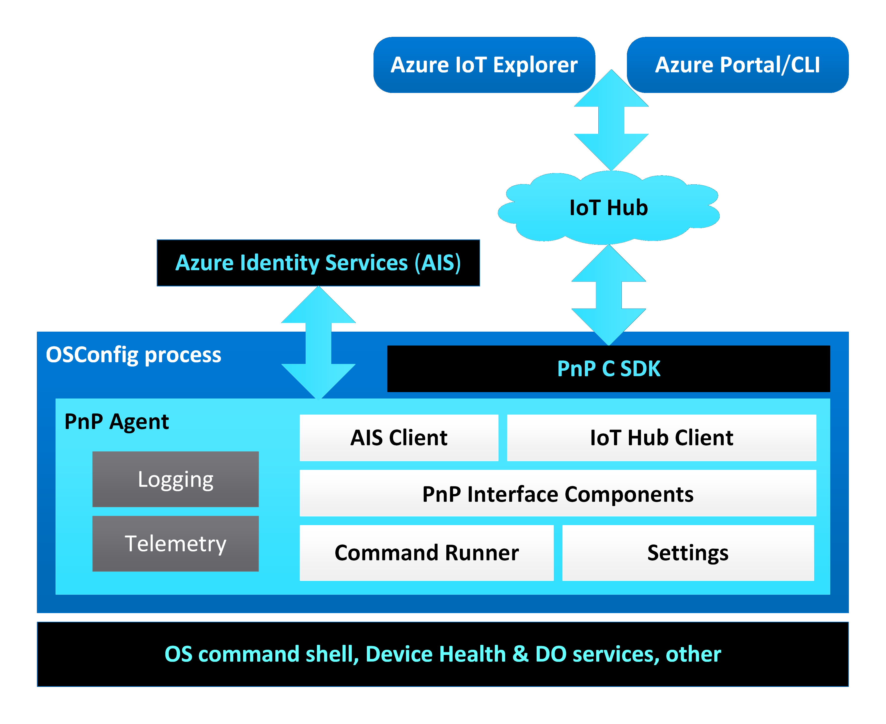

Azure Device OS Configuration (OSConfig) - Roadmap
==================================================

# 1. Introduction

Azure OSConfig is a modular security configuration stack for Linux Edge devices. OSConfig supports multi-authority device management over Azure and Azure Portal/CLI, GitOps, as well as local management.

This document describes the development roadmap of the Azure OSConfig project.

During any of these stages OSConfig can be extended by adding new [OSConfig Management Modules](modules.md).

For more information on OSConfig and the various component name and other terminology used in this document see the [OSConfig North Star Architecture](architecture.md) document.

# 1. Monolithic Agent (codename Iron)

Main target scenarios: apply policy settings and execute reboot and other commands remotely via the IoT Hub.

- In its first release codename Iron OSConfig is a monolithic (all-in-one) PnP Agent including Settings (with basic Device Health Telemetry and few Delivery Optimization (DO) policies configuration) and CommandRunner (including Shutdown, Reboot, and running custom commands/scripts).
- This agent process runs as a daemon (background service) under root authority to allow its embedded management modules to perform their administrative configuration functions.
- OSConfig runs under a device identity with a manual IoT Hub connection string read from a local file.
- There are embedded versions of CommandRunner and Settings hard coded into the agent.
- The PnP Agent writes telemetry events and traces to its own and to system logs.
- The remote operator uses Azure IoT Explorer and/or Azure Portal or Azure Command Line INterface (CLI) to configure the device.

# 2. Detached Modules (codename Cobalt)

The modules become detached Shared Object (.so) libraries, partners can develop modules on their own, two new modules Networking and Firewall are added.

- In its second version codename Cobalt, OSConfig gains detached Management Modules running as Dynamically Loaded Shared Object libraries (.so).
- Although OSConfig continues to still run all in one process, modules can be dynamically discovered, loaded, and unloaded at run time (and, most importantly, can be developed by other teams).
- With the Management Modules specification shared with the partners to guide Module development and newly introduced PnP/DTDL-agnostic Module Interface Model (MIM), new modules are decoupled from PnP and easier designed.
- The PnP Agent runs under a module identity dynamically obtained from Azure Identity Service (AIS) and with this it can share the device channel with other PnP agents (ADU, Defender, Edge Runtime, etc.)
- The CommandRunner and Settings modules detach into their own separate module SOs.
- New modules for Networking and Firewall configuration are introduced.
- New reusable logging library that all OSConfig components can use.
- The Modules Manager is introduced as a static library linked into the agent process.

# 3. Detached Agent & Local Management Authorities (codename Nickel)

OSConfig continues to run as a monolithic process and can accept requests from agentless management authorities like OOBE. More module scenarios are enabled (TPM, etc.)

- The RC/DC Watcher is introduced. OSConfig can accept requests from Local Management Authorities (like OOBE).
- Modules continue to work unchanged, same as in previous release, as Dynamically Loaded Shared Object libraries exporting the MMI C API.
- The Modules Manager is introduced and loads the module libraries in-proc.
- Tpm and other new Management Modules can appear (not shown in diagram).
- The agent becomes completely detached from PnP interfaces, MIMs and modules.

# 4. Detached Platform (codename Copper)

The concept of OSConfig Adapters is introduced. The Management Platform runs in its own daemon process. OSConfig can accept request from both local and remote management authorities.

- The OSConfig separates the Agent and the Management Platform into two separate daemon processes.
- The IPC REST API over Unix Domain Sockets (UDS) and HTTP for MPI is introduced.
- The Management Platform can accept MPI requests from other Managament Authority Adapters.
- Modules continue to work unchanged, same as in previous releases, as Dynamically Loaded Shared Object libraries exporting the MMI C API. The Platform loads these libraries in-proc.
- Other Management Modules appear (not shown in diagram).

# 5. GitOps, Azure Policy, Security Baseline (codename Germanium)

The Universal NRP and the SecurityBaseline Module can be used to audit and remediate the Linux Security Baseline over Azure Policy and AutoManage Machine Configuration.

- A new GitOps DC Watcher is added for accepting desired configuration from a Git repository.
- A new OSConfig Universal NRP is added for Azure Policy and Machine Configuration.
- A new SecurityModule module implements the Azure Security Baseline for Linux.
- Modules continue to work unchanged, same as in previous releases, as Dynamically Loaded Shared Object libraries exporting the MMI C API. The Platform loads these libraries in-proc.

# 6. SSH Posture Control, ASB v2, OSConfig for MC, IoT Hub becomes optional (codename Dilithium)

- A new Azure Policy for SSH Posture Control is published, running via the OSConfig Universal NRP.
- A new Azure Security Baseline (ASB) for Linux v2 implementation is added into the separate ASB libraries.
- The Universal NRP and the SecurityBaseline module both link to the same ASB libraries.
- The concept of 'OSConfig for MC'is introduced, where the Universal NRP implements this speacialized, targeted OSConfig, inside of a single NRP.
- The RC/DC channel becomes by default enabled, while the IoT Hub channel becomes by default disabled.
- The SecurityBaseline module works with the RC/DC Watcher for executing ASB v2 when invoked by local managamenet authorities.
- Modules continue to work as Dynamically Loaded Shared Object libraries exporting the MMI C API. The Platform loads these libraries in-proc.

# 7. Isolated Modules - the current North Star (codename Krypton)

Main target scenario: OSConfig Management Modules run isolated in their own processes, Azure Policy and GitHub

- The IPC REST API over UDS for Management Modules Interface (MMI) is introduced.
- The Module Host is introduced. The Modules Manager instead of loading in-proc the module libraries, it forks a Module Host process to load each module library out-of-proc of the platform.
- Modules continue to work unchanged, same as in previous releases, as Dynamically Loaded Shared Object libraries exporting the MMI C API. The Module Host provides the MMI REST API on top.
- New Storage and Downloader utility libraries are introduced for Platform and Modules to use.
- Other new Management Modules appear (not shown in diagram).

